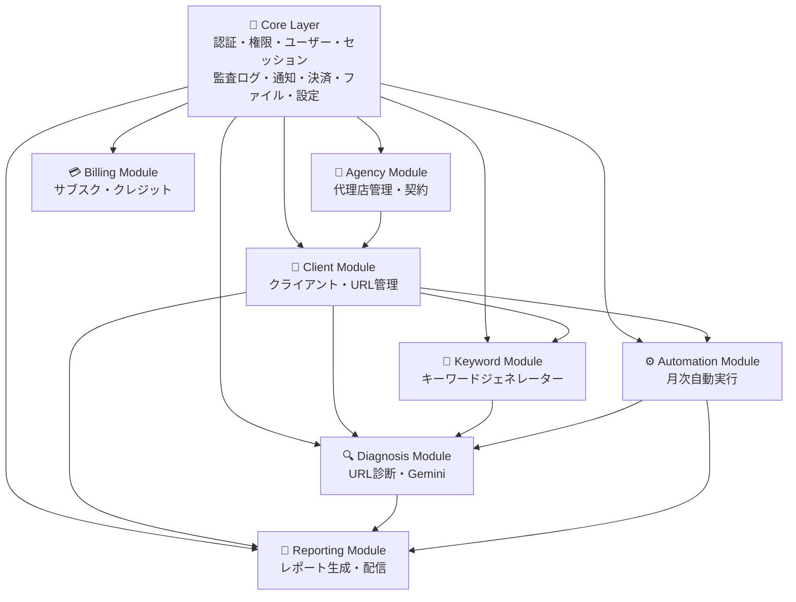

# LLMO Score - 完全版設計書

**プロジェクト名**: LLMO Score  
**バージョン**: FINAL  
**設計方針**: B2B SaaS 代理店モデル × モジュールアーキテクチャ × AI開発プロセステンプレート  
**最終目標**: 代理店が完全自動・ワンオペでクライアントの LLMO 対策を運用できるツール

---

# 第1章: ビジネスモデル

## 1.1 全体構造

```
あなた（LLMO Score 開発・運営）
  ↓ ツール提供（代理店向け月額サブスク）
Web制作会社（代理店）
  ↓ 営業・提案・運用
中小企業・店舗（クライアント）
  ↓ 月額料金支払い
代理店
  ↓ 毎月のサブスク / ライセンス料
あなた
```

## 1.2 収益の流れ

```
クライアント（中小企業）
  月額 2-3万円（HP管理料に含む）
    ↓ 代理店が徴収
代理店（Web制作会社）
  月額サブスクをあなたへ支払い
    ↓
あなた（LLMO Score）
  代理店 × 10社〜 = 安定ストック収入
```

## 1.3 代理店のメリット

```
BEFORE:
  手動で LLMO 分析 → 1社2-3時間 × 月1回 × 10社 = 月20-30時間

AFTER:
  ダッシュボードで「診断実行」クリック → 1社5分 × 10社 = 50分
  キーワードジェネレーターで提案資料が自動生成
  月次レポートも自動配信
  HP管理料 > サブスク料金 = 利益
```

## 1.4 3フェーズ段階的展開

```
Phase 1: AI診断・レポート事業（フロント）
  → クライアントの URL を診断
  → 簡易・詳細レポート自動生成
  → 「危機感」醸成 → Phase 2 へ誘導

Phase 2: 構造化・最適化事業（バック）
  → Schema.org 実装ガイド自動生成
  → robots.txt / FAQ / コンテンツ最適化テンプレート
  → 代理店が実装（または実装代行）

Phase 3: AI時代のE-E-A-T運用（継続ストック）
  → 毎月自動で診断実行
  → 月次レポート自動配信
  → 改善提案の自動生成
  → Slack通知
```

---

# 第2章: ユーザー・ロール・アカウント設計

## 2.1 ユーザー階層

```
あなた（System Owner）
  ↓
代理店（Agency）= LLMO Score の契約者
  ├── 親アカウント（Admin）= 代表者・管理者
  ├── 子アカウント（Staff）= 従業員
  └── 子アカウント（Viewer）= 閲覧のみ
        ↓
クライアント（Client）= 代理店の顧客（中小企業）
  ※ クライアントはアプリにログインしない
  ※ 代理店が代行して管理する
```

## 2.2 親子アカウント構造

```
代理店（親アカウント）
├── 管理者（Admin）= 親アカウント所有者
│   ├── 課金管理・プラン変更
│   ├── 子アカウント追加・削除
│   ├── 全クライアント閲覧
│   └── クレジット配分管理
│
├── 子アカウント1（Staff・従業員A）
│   ├── 独立セッション（同時ログイン OK）
│   ├── 個別クレジット割り当て
│   └── 担当クライアントのみ操作
│
├── 子アカウント2（Staff・従業員B）
│   └── ...
│
└── 子アカウント3（Viewer・閲覧のみ）
    └── レポート閲覧のみ
```

## 2.3 ロール・権限マトリクス

```
操作                   | Admin | Staff | Viewer
-----------------------|-------|-------|-------
クライアント追加       | ✅    | ✅    | ❌
クライアント編集       | ✅    | ✅    | ❌
クライアント削除       | ✅    | ❌    | ❌
診断実行               | ✅    | ✅    | ❌
キーワード生成         | ✅    | ✅    | ❌
レポート閲覧           | ✅    | ✅    | ✅
レポートダウンロード   | ✅    | ✅    | ✅
レポート配信設定       | ✅    | ✅    | ❌
月次自動実行設定       | ✅    | ✅    | ❌
課金・プラン変更       | ✅    | ❌    | ❌
子アカウント管理       | ✅    | ❌    | ❌
クレジット配分変更     | ✅    | ❌    | ❌
API キー管理           | ✅    | ❌    | ❌
```

## 2.4 セッション管理

```
親アカウント = 同時に1ブラウザのみ
子アカウント = 各子アカウントが同時に1ブラウザのみ

✅ Admin + 子1 + 子2 + 子3 = 4人同時ログイン OK
❌ 子1が PC Chrome + iPad Safari = NG（1子1ブラウザ）

同一ブラウザの複数タブ:
  → セッション共有（警告なし）

別ブラウザでログイン:
  → 警告「別ブラウザでログインしています」→ ユーザー選択
```

---

# 第3章: 課金設計

## 3.1 プラン比較表

```
                        | Starter      | Pro          | Enterprise
------------------------|--------------|--------------|----------------
基本月額                | 15,000円     | 30,000円     | 80,000円
年払い（10%割引）       | 162,000円    | 324,000円    | 864,000円
                        |              |              |
【子アカウント】        |              |              |
含まれる子アカウント数  | 2名          | 5名          | 15名
1子アカウントあたり     |              |              |
  クレジット/月         | 100          | 200          | 500
代理店全体の            |              |              |
  総クレジット/月       | 200          | 1,000        | 7,500
子アカウント追加料金    | 3,000円/名   | 2,500円/名   | 2,000円/名
追加子アカウントの      |              |              |
  クレジット/月         | 100          | 200          | 500
子アカウント上限        | 5名          | 15名         | 無制限
                        |              |              |
【クライアント】        |              |              |
クライアント数上限      | 10社         | 30社         | 100社
クライアント追加料金    | 不可         | 1,000円/社   | 500円/社
                        |              |              |
【機能】                |              |              |
簡易レポート            | ✅           | ✅           | ✅
詳細レポート            | ❌           | ✅           | ✅
キーワードレポート      | ❌           | ✅           | ✅
月次自動実行            | 5社まで      | 30社まで     | 100社まで
代理店ブランディング    | ❌           | ✅           | ✅
Slack 統合              | ❌           | ❌           | ✅
API アクセス            | ❌           | ❌           | ✅
サポート                | メール       | メール24h    | 専任+電話
```

## 3.2 クレジット消費表

```
操作                    | 消費クレジット
------------------------|---------------
キーワード生成          | 3
簡易診断（URL分析）     | 5
詳細診断（フル分析）    | 15
簡易レポート PDF        | 2
詳細レポート PDF        | 5
キーワードレポート PDF  | 3
月次自動実行（1社分）   | 8
```

## 3.3 プラン別作業量目安

```
【Starter: 子2名 × 100cr = 200cr/月】
  2人で月10社の簡易診断・レポートが可能
  → 11社目 or 詳細レポートが必要 → Pro へ ⬆️

【Pro: 子5名 × 200cr = 1,000cr/月】
  5人で月30社の詳細診断・レポートが可能
  → 30社超え or 従業員追加 → Enterprise へ ⬆️

【Enterprise: 子15名 × 500cr = 7,500cr/月】
  15人で月100社の完全自動運用が可能
```

## 3.4 子アカウント追加料金

```
Starter:    +3,000円/名/月（追加1名 = 100cr 付き、上限5名）
Pro:        +2,500円/名/月（追加1名 = 200cr 付き、上限15名）
Enterprise: +2,000円/名/月（追加1名 = 500cr 付き、上限なし）
```

## 3.5 アップグレード誘導設計

```
【Starter → Pro にしたくなる瞬間】

Starter で子3名追加した場合:
  15,000 + 3名 × 3,000 = 24,000円/月（子5名 × 100cr = 500cr）

Pro にアップグレードした場合:
  30,000円/月（子5名 × 200cr = 1,000cr）

→ わずか +6,000円で、クレジット2倍 + 詳細レポート解放
→ 「Pro の方がお得」と気づく

【Pro → Enterprise にしたくなる瞬間】

Pro で子10名追加した場合:
  30,000 + 10名 × 2,500 = 55,000円/月（子15名 × 200cr = 3,000cr）

Enterprise にアップグレードした場合:
  80,000円/月（子15名 × 500cr = 7,500cr）

→ 差額25,000円で、クレジット2.5倍 + Slack + API解放
→ 「Enterprise の方がお得」と気づく
```

## 3.6 クレジット追加購入

```
月中にクレジット不足の場合:

Starter:    +100cr = 1,500円
Pro:        +200cr = 2,500円 / +500cr = 5,000円
Enterprise: +500cr = 5,000円 / +1,000cr = 8,000円

購入方法: Admin がダッシュボードから即時購入 → 指定子アカウントに反映
有効期限: 当月末でリセット
```

## 3.7 月額請求額の計算式

```
月額 = 基本プラン
     + 追加子アカウント数 × 子アカウント追加料金
     + 追加クライアント数 × クライアント追加料金
     + クレジット追加購入
     - 年払い割引（10%）
```

## 3.8 収益シミュレーション

```
【Month 6】
Starter 15社 × 平均16,000円  = 240,000円
Pro 8社 × 平均33,000円       = 265,000円
Enterprise 2社 × 平均85,000円 = 170,000円
月間売上: 675,000円 / 年間: 8,100,000円

【Month 12】
Starter 25社 × 平均17,000円   = 425,000円
Pro 15社 × 平均35,000円       = 525,000円
Enterprise 5社 × 平均90,000円  = 450,000円
月間売上: 1,400,000円 / 年間: 16,800,000円

あなたの労働: 月20-40時間
```

---

# 第4章: モジュールアーキテクチャ設計

## 4.1 3層構成

### Layer 1: Core（共通基盤）

| # | モジュール | 責務 |
|---|-----------|------|
| 1 | Authentication | メール認証・Firebase Auth・JWT |
| 2 | Authorization | ロール・権限管理（Admin/Staff/Viewer） |
| 3 | User Management | ユーザープロフィール・チーム管理 |
| 4 | Session Management | セッション管理・複数接続制御 |
| 5 | Audit Log | 全操作記録・監査証跡 |
| 6 | Notification | メール・Slack・アプリ内通知 |
| 7 | Payment | Stripe 統合・サブスク管理 |
| 8 | File Management | PDF・ファイル・Cloud Storage |
| 9 | Settings | アプリ設定・システム設定 |

### Layer 2: Business Modules

| # | モジュール | 責務 |
|---|-----------|------|
| A | Agency | 代理店管理・契約・ブランディング |
| B | Client | クライアント（中小企業）管理・URL管理 |
| C | Diagnosis | URL診断・Gemini統合・スコア計算 |
| D | Keyword | キーワードジェネレーター・Google Places統合 |
| E | Reporting | レポート生成・PDF出力・配信 |
| F | Billing | サブスク・親子アカウント・クレジット・請求 |
| G | Automation | 月次自動実行・ワークフロー |

### Layer 3: Application Composition

```
LLMO Score = Core（9） + Agency + Client + Diagnosis + Keyword + Reporting + Billing + Automation
```

## 4.2 モジュール依存図



## 4.3 推奨フォルダ構成

```
llmo-score/
├── backend/
│   ├── app/
│   │   ├── core/
│   │   │   ├── authentication/
│   │   │   │   ├── __init__.py
│   │   │   │   ├── models.py
│   │   │   │   ├── schemas.py
│   │   │   │   ├── services.py
│   │   │   │   └── router.py
│   │   │   ├── authorization/
│   │   │   ├── user_management/
│   │   │   ├── session_management/
│   │   │   ├── audit_log/
│   │   │   ├── notification/
│   │   │   ├── payment/
│   │   │   ├── file_management/
│   │   │   └── settings/
│   │   │
│   │   ├── modules/
│   │   │   ├── agency/
│   │   │   ├── client/
│   │   │   ├── diagnosis/
│   │   │   ├── keyword/
│   │   │   ├── reporting/
│   │   │   ├── billing/
│   │   │   └── automation/
│   │   │
│   │   ├── shared/
│   │   │   ├── api/
│   │   │   ├── db/
│   │   │   ├── utils/
│   │   │   └── constants/
│   │   │
│   │   ├── main.py
│   │   └── config.py
│   │
│   ├── tests/
│   ├── docs/
│   │   ├── architecture/
│   │   │   └── module-plan.md
│   │   └── session_log.md
│   ├── requirements.txt
│   ├── Dockerfile
│   └── CLAUDE.md
│
├── frontend/
│   ├── app/
│   │   ├── (auth)/
│   │   │   ├── login/
│   │   │   └── signup/
│   │   └── dashboard/
│   │       ├── page.tsx
│   │       ├── clients/
│   │       ├── diagnoses/
│   │       ├── keywords/
│   │       ├── reports/
│   │       ├── billing/
│   │       ├── automation/
│   │       └── settings/
│   ├── components/
│   │   ├── core/
│   │   ├── modules/
│   │   └── shared/
│   ├── lib/
│   └── types/
│
└── CLAUDE.md
```

## 4.4 移行順序

```
Phase 1（Week 1-2）: Core層
  1. Authentication → 2. User Management → 3. Session Management
  4. Authorization → 5. Audit Log

Phase 2（Week 2）: 基盤 Business Modules
  6. Agency Module → 7. Client Module

Phase 3（Week 2-3）: 主要 Business Modules
  8. Keyword Module → 9. Diagnosis Module → 10. Reporting Module

Phase 4（Week 3-4）: 課金・自動化
  11. Billing Module → 12. Automation Module

Phase 5（Week 4）: 統合テスト・デプロイ
```

---

# 第5章: 各モジュール詳細設計

## 5.1 Core Layer

### Authentication Module

**責務:** メール認証・Firebase Auth・JWT生成・検証  
**保持データ:** users, email_confirmations, password_reset_tokens  
**公開API:**
```
signup(email, password) → { user_id, token }
login(email, password) → { access_token, refresh_token }
verifyEmail(token) → { success }
resetPassword(email) → { success }
```
**依存:** なし  
**再利用例:** 全SaaS基盤

### User Management Module

**責務:** ユーザープロフィール管理・検索  
**保持データ:** user_profiles  
**公開API:**
```
getUser(user_id) → user_profile
updateUser(user_id, data) → { success }
deleteUser(user_id) → { success }
```
**依存:** Authentication  
**再利用例:** CRM, ERP

### Session Management Module

**責務:** セッション作成・更新・削除・複数接続制御  
**保持データ:**
```firestore
sessions/{session_id}
├── user_id
├── child_account_id（子アカウントの場合）
├── agency_id
├── device_id
├── browser_id
├── browser_name
├── os
├── ip_address
├── access_token
├── refresh_token
├── access_token_expires_at（1時間）
├── refresh_token_expires_at（30日）
├── last_activity
├── status（active/revoked）
└── revoke_reason
```
**公開API:**
```
createSession(user_id, device_info) → { tokens }
getActiveSessions(user_id) → sessions[]
revokeSession(session_id) → { success }
checkMultipleConnection(user_id, browser_id) → { is_multiple, existing }
```
**特別ルール:**
```
子アカウントごとに独立セッション
✅ Admin + 子1 + 子2 = 同時ログインOK
❌ 子1が2台同時 = NG（警告 → ユーザー選択）
```
**依存:** Authentication  
**再利用例:** マルチデバイス対応SaaS

### Authorization Module

**責務:** ロール管理（Admin/Staff/Viewer）・権限確認  
**保持データ:** roles, permissions  
**公開API:**
```
hasPermission(user_id, resource, action) → boolean
getUserRoles(user_id) → roles[]
```
**依存:** User Management  
**再利用例:** 権限管理が必要な全SaaS

### Audit Log Module

**責務:** 全操作ログ記録  
**保持データ:** audit_logs  
**公開API:**
```
recordLog(user_id, action, resource_type, details) → { log_id }
getAuditLog(filter) → logs[]
```
**依存:** User Management  
**再利用例:** コンプライアンス対応SaaS

### Notification Module

**責務:** メール送信（SendGrid）・Slack通知・アプリ内通知  
**保持データ:** email_templates, notifications  
**公開API:**
```
sendEmail(recipient, template, data) → { success }
sendSlack(channel, message) → { success }
sendNotification(user_id, message) → { success }
```
**依存:** User Management  
**再利用例:** 通知機能が必要な全SaaS

### Payment Module

**責務:** Stripe統合・サブスク管理・Webhook処理  
**保持データ:** stripe_customers, stripe_subscriptions, webhook_events  
**公開API:**
```
createCheckoutSession(agency_id, plan) → { checkout_url }
getSubscription(agency_id) → subscription_data
cancelSubscription(agency_id) → { success }
handleStripeWebhook(event) → { success }
```
**依存:** User Management  
**再利用例:** 決済が必要な全SaaS

### File Management Module

**責務:** PDF生成・ファイル保存・Cloud Storage管理  
**保持データ:** files  
**公開API:**
```
uploadFile(file, user_id) → { file_id, url }
downloadFile(file_id) → file_bytes
generatePDF(content, template) → { pdf_url }
```
**依存:** User Management, Audit Log  
**再利用例:** ファイル管理が必要な全SaaS

### Settings Module

**責務:** アプリ設定・システム設定  
**保持データ:** app_settings  
**公開API:**
```
getSettings(agency_id) → settings
updateSettings(agency_id, data) → { success }
```
**依存:** Authentication  
**再利用例:** 設定管理が必要な全SaaS

---

## 5.2 Business Modules

### Module A: Agency Module

**責務:** 代理店登録・管理・契約・スタッフ管理・ブランディング  
**保持データ:**
```firestore
agencies/{agency_id}
├── name
├── owner_user_id（Admin）
├── plan（starter/pro/enterprise）
├── billing_cycle（monthly/yearly）
├── status（active/suspended/canceled）
├── included_child_accounts（2/5/15）
├── additional_child_accounts
├── max_child_accounts（5/15/unlimited）
├── credits_per_child（100/200/500）
├── included_clients（10/30/100）
├── additional_clients
├── branding
│   ├── logo_url
│   ├── primary_color
│   └── contact_email
├── created_at
└── stripe_customer_id

agency_members/{member_id}
├── agency_id
├── user_id
├── role（admin/staff/viewer）
├── joined_at
└── status（active/invited/disabled）
```
**公開API:**
```
createAgency(info) → { agency_id }
getAgency(agency_id) → agency_data
updateAgency(agency_id, data) → { success }
addStaff(agency_id, email, role) → { member_id }
removeStaff(agency_id, member_id) → { success }
getAgencyMembers(agency_id) → members[]
getAgencyStats(agency_id) → stats
```
**依存:** Core（Authentication, User Management, Authorization, Audit Log）  
**再利用例:** マルチテナントSaaS、代理店管理

### Module B: Client Module

**責務:** クライアント（中小企業）情報管理・URL管理・担当スタッフ紐づけ  
**保持データ:**
```firestore
clients/{client_id}
├── agency_id
├── name（企業名）
├── url（ホームページURL）
├── industry（業種）
├── prefecture（都道府県）
├── city（市町村・オプション）
├── contact_name
├── contact_email
├── contact_phone
├── notes
├── assigned_staff_ids[]（担当子アカウント）
├── status（active/paused/archived）
├── settings
│   ├── auto_diagnosis_enabled
│   ├── auto_diagnosis_day
│   ├── report_delivery_email
│   └── report_delivery_slack
├── created_at
└── created_by
```
**公開API:**
```
createClient(agency_id, info) → { client_id }
getClient(client_id) → client_data
updateClient(client_id, data) → { success }
deleteClient(client_id) → { success }
getClientsByAgency(agency_id, filter?) → clients[]
getClientStats(client_id) → { diagnosis_count, latest_score, trend }
```
**依存:** Core, Agency Module  
**再利用例:** CRM、顧客管理

### Module C: Diagnosis Module

**責務:** クライアントのURLを診断・Gemini統合・スコア計算・AI別分析・キーワード別分析  
**保持データ:**
```firestore
diagnoses/{diagnosis_id}
├── client_id
├── agency_id
├── executed_by（子アカウントID）
├── target_url
├── industry
├── location（prefecture + city）
├── selected_keywords[]
│
├── scores
│   ├── overall（0-100）
│   ├── ai_awareness（0-100）
│   ├── competitive_ranking（0-100）
│   ├── geo_search（0-100）
│   ├── eeat_score（0-100）
│   └── growth_potential（0-100）
│
├── ai_analysis
│   ├── gemini（mentioned, mention_count, context）
│   ├── chatgpt（mentioned, mention_count, context）
│   └── claude（mentioned, mention_count, context）
│
├── keyword_analysis[]
│   ├── keyword
│   ├── score（0-100）
│   ├── ai_mentions
│   └── recommendation
│
├── findings
│   ├── strengths[]
│   ├── weaknesses[]
│   └── opportunities[]
│
├── recommendations[]
│   ├── priority（1-10）
│   ├── category（🔴必須/🟠推奨/🟡補助）
│   ├── action
│   ├── impact
│   └── timeline
│
├── site_analysis
│   ├── has_schema_org
│   ├── has_robots_txt
│   ├── has_sitemap
│   ├── has_faq_page
│   ├── has_about_page
│   ├── mobile_friendly
│   ├── page_speed_score
│   └── ssl_enabled
│
├── projections
│   ├── six_month（0-100）
│   └── twelve_month（0-100）
│
├── credits_consumed
├── status（completed/pending/error）
└── created_at
```
**公開API:**
```
runDiagnosis(client_id, keywords[]) → { diagnosis_id }
getDiagnosis(diagnosis_id) → diagnosis_data
getDiagnosisByClient(client_id) → diagnoses[]
getDiagnosisByAgency(agency_id, filter?) → diagnoses[]
compareDiagnoses(id_1, id_2) → comparison
```
**依存:** Core, Client Module, Keyword Module  
**外部API:** Google Gemini API  
**再利用例:** AI診断SaaS全般、SEO診断ツール

### Module D: Keyword Module

**責務:** キーワード自動生成・Google Places競合分析・提案理由の明示・キーワードレポート  

**設計意図:**
```
目的1: 代理店のキーワード選定時間を短縮（2-3時間 → 5秒）
目的2: クライアントへの「しっかりした提案」
  → 「こういったキーワードで検索されています」
  → 「このキーワードでの認知度が低いです」
  → 「この対策をすればスコアが上がります」
目的3: 素人でも代理店になれる
```

**保持データ:**
```firestore
keyword_sets/{keyword_set_id}
├── client_id
├── agency_id
├── generated_by
├── industry
├── prefecture
├── city
├── target_url
│
├── competitor_data[]
│   ├── name（競合企業名）
│   ├── address
│   ├── summary（説明文）
│   ├── types
│   └── source（google_places）
│
├── keywords[]
│   ├── rank（1-15）
│   ├── keyword（例：「福井市 新築住宅」）
│   ├── search_volume（very_high/high/medium/low）
│   ├── relevance（0-100）
│   ├── category（基本/スタイル/サービス/ニーズ/地域特化）
│   ├── reason（なぜこのキーワードが重要か）
│   ├── competitor_usage（「競合12社中9社がターゲット」）
│   └── recommendation（具体的な改善提案）
│
├── market_analysis
│   ├── market_characteristics
│   ├── customer_needs
│   ├── competitive_landscape
│   ├── opportunity_areas
│   └── recommended_strategy
│
├── created_at
└── status
```
**公開API:**
```
generateKeywords(client_id) → { keyword_set_id }
getKeywordSet(keyword_set_id) → keyword_set_data
getKeywordSetsByClient(client_id) → keyword_sets[]
regenerateKeywords(keyword_set_id) → { keyword_set_id }
exportKeywordReport(keyword_set_id) → { pdf_url }
```
**依存:** Core, Client Module  
**外部API:** Google Places API, Google Gemini API  
**再利用例:** SEOキーワードツール、マーケティング支援SaaS

### Module E: Reporting Module

**責務:** レポート生成・PDF出力・代理店ブランディング・クライアント配信  
**保持データ:**
```firestore
reports/{report_id}
├── diagnosis_id / keyword_set_id
├── client_id
├── agency_id
├── generated_by
├── report_type（simple/detailed/keyword/monthly）
├── pdf_url
├── branding（logo, color, contact）
├── delivery（email, status, delivered_at）
├── generated_at
└── expires_at
```
**レポート種別:**
```
簡易レポート（1ページ）: AIスコア + 危機感メッセージ + 代理店連絡先
詳細レポート（12-16ページ）: フル分析 + 実装テンプレート + 改善シミュレーション
キーワードレポート（6-8ページ）: キーワード分析 + 競合使用状況 + 推奨戦略
月次レポート（4-6ページ）: スコア推移 + 効果測定 + 来月の推奨施策
```
**公開API:**
```
generateSimpleReport(diagnosis_id) → { pdf_url }
generateDetailedReport(diagnosis_id) → { pdf_url }
generateKeywordReport(keyword_set_id) → { pdf_url }
generateMonthlyReport(client_id, month) → { pdf_url }
deliverReport(report_id, email) → { success }
getReportsByClient(client_id) → reports[]
```
**依存:** Core（File Management, Notification）, Diagnosis Module, Keyword Module, Client Module  
**再利用例:** レポート自動生成SaaS

### Module F: Billing Module

**責務:** 代理店サブスク・親子アカウント課金・クレジット管理・請求  
**保持データ:**
```firestore
subscriptions/{subscription_id}
├── agency_id
├── plan
├── billing_cycle
├── status
├── stripe_subscription_id
└── current_period

child_accounts/{child_id}
├── agency_id
├── user_id
├── email, name, role
├── monthly_credit_limit
├── monthly_credit_used
├── credit_reset_date
├── active_session_id
├── assigned_client_ids[]
├── status
└── joined_at

api_credits/{credit_id}
├── agency_id
├── monthly_limit（全体）
├── monthly_used（全体）
└── last_reset

credit_usage/{usage_id}
├── agency_id
├── child_account_id
├── amount_consumed
├── usage_type
├── resource_id
├── client_id
├── created_at
└── balance_after

credit_purchases/{purchase_id}
├── agency_id
├── purchased_by
├── amount
├── price
├── allocated_to
├── stripe_payment_id
└── expires_at

invoices/{invoice_id}
├── agency_id
├── amount
├── breakdown（基本+追加子+追加クライアント+追加クレジット）
├── status
├── stripe_invoice_id
└── created_at
```
**公開API:**
```
getSubscription(agency_id) → subscription_data
upgradePlan(agency_id, new_plan) → { success }
switchToYearly(agency_id) → { success }
addChildAccount(agency_id, email, role) → { child_id }
removeChildAccount(agency_id, child_id) → { success }
getChildAccounts(agency_id) → child_accounts[]
getCredits(agency_id) → { total, used, by_child[] }
getChildCredits(child_id) → { limit, used, remaining }
reallocateCredits(agency_id, child_id, new_limit) → { success }
purchaseCredits(agency_id, amount, allocate_to) → { success }
consumeCredit(child_id, amount, usage_type) → { remaining }
getInvoices(agency_id) → invoices[]
calculateMonthlyCharge(agency_id) → breakdown
getUpgradeComparison(agency_id) → comparison
```
**依存:** Core（Payment, User Management, Audit Log）, Agency Module  
**再利用例:** B2B SaaS課金基盤

### Module G: Automation Module

**責務:** 月次自動診断スケジューリング・自動レポート生成・配信・Slack通知  
**保持データ:**
```firestore
automation_schedules/{schedule_id}
├── agency_id
├── client_id
├── schedule_type（monthly/weekly/custom）
├── execution_day（毎月〇日）
├── tasks[]（run_diagnosis, generate_keywords, generate_report, deliver_report）
├── last_execution
├── next_execution
├── status（active/paused）
└── created_at

automation_logs/{log_id}
├── schedule_id
├── agency_id, client_id
├── executed_at
├── tasks_completed[], tasks_failed[]
├── credits_consumed
└── error_details
```
**公開API:**
```
createSchedule(client_id, config) → { schedule_id }
updateSchedule(schedule_id, config) → { success }
pauseSchedule(schedule_id) → { success }
getSchedulesByAgency(agency_id) → schedules[]
getAutomationLogs(agency_id) → logs[]
executeManually(schedule_id) → { execution_id }
```
**依存:** Core（Notification, Audit Log）, Diagnosis, Keyword, Reporting, Client Module  
**再利用例:** 自動化プラットフォーム

---

# 第6章: 診断フロー設計

## 6.1 代理店スタッフの操作フロー

```
【Step 1】クライアント登録（初回のみ）

  企業名:   [協和自工株式会社]
  URL:      [https://kyowa-jiko.co.jp]  ← 重要
  業種:     [建設・不動産 ▼]
  都道府県: [福井県 ▼]
  市町村:   [福井市 ▼]（オプション）
  担当者名: [山田太郎]
  メール:   [yamada@kyowa-jiko.co.jp]

  [登録]

【Step 2】キーワード生成

  [キーワード分析を実行] ← クリック

  Backend処理:
    1. Google Places API → 「福井市 建設」の競合20社分析
    2. Gemini → 「実際に検索されるキーワード TOP 15」生成

  結果表示:
    ☑ 福井市 新築住宅     非常に多く検索
      💭 この地域で最も検索される
      📊 競合12社中9社がターゲット
      💡 提案: トップページに明記が必要

    ☑ 福井 木造注文住宅    よく検索
      💭 自然素材志向の顧客が多い地域
      📊 競合12社中5社がターゲット
      💡 提案: 施工事例ページの新設を推奨

    ☑ 福井市 リフォーム    よく検索
      💭 古い木造家屋が多く改修ニーズが高い
      📊 競合12社中8社がターゲット
      💡 提案: リフォーム専用ページが必要

    ... （最大 15 個）

  [キーワードレポートをPDF出力]
  [選択したキーワードで診断を実行]

【Step 3】診断実行

  URL + 選択キーワード + 業種 + 地域
    ↓ Gemini で分析
    ↓ サイト構造分析（Schema.org, robots.txt 等）
    ↓ AI エンジン別出現分析（Gemini/ChatGPT/Claude）
    ↓ キーワード別スコア
    ↓ 改善提案生成

【Step 4】レポート生成・配信

  [簡易レポート PDF]（1ページ・危機感醸成用）
  [詳細レポート PDF]（12-16ページ・提案資料用）
  [クライアントにメール配信]

【Step 5】月次自動化（設定済みの場合）

  毎月〇日に自動実行:
    診断 → レポート生成 → メール配信 → Slack通知
```

---

# 第7章: 技術スタック

```
Frontend:  Next.js 14 / Vercel / Tailwind CSS / shadcn/ui / Firebase Auth
Backend:   FastAPI（Python 3.11）/ Google Cloud Run / Firestore / Cloud Storage
AI:        Google Gemini API
地域分析:  Google Places API
課金:      Stripe API
メール:    SendGrid
通知:      Slack Webhook
自動化:    Cloud Scheduler + Cloud Tasks
PDF:       reportlab / WeasyPrint / Jinja2
```

---

# 第8章: CLAUDE.md 運用ルール

```markdown
# LLMO Score - Architecture Rules

## プロジェクト概要
B2B SaaS。代理店（Web制作会社）がクライアント（中小企業）の
AI検索認知度を診断・改善するツール。
一般ユーザーは使用しない。

## モジュール構成

### Core Layer
authentication/ authorization/ user_management/ session_management/
audit_log/ notification/ payment/ file_management/ settings/

### Business Modules
agency/ client/ diagnosis/ keyword/ reporting/ billing/ automation/

### Shared
api/ ui/ utils/

## ルール

### 禁止事項
❌ 他モジュールの DB へ直接アクセス（Service API 経由のみ）
❌ 1回の変更で複数モジュール変更
❌ 推測実装
❌ session_log.md の上書き・削除

### 必須事項
✅ 1回の変更は 1 モジュールのみ
✅ 作業前に「作業内容（予定）」を docs/session_log.md に記入
✅ 作業後に「作業結果」を docs/session_log.md に追記
✅ 不明点は質問する
✅ 動作変更より構造改善を優先
✅ 新機能は設計案 → 承認 → 実装

## Session Log 記録ルール（必須・例外なし）

記録場所: docs/session_log.md

1. アクション前に「### 作業内容（予定）」を記入してから作業開始
2. アクション後に「### 作業結果」を追記

禁止:
- アクション後にまとめて「作業内容」を書くことは禁止
- session_log.md の上書き・削除しない
- ログ追記をスキップしない

セッション終了時にログ内容を確認し、すべての作業が記録されていることを確認する。
```

---

# 第9章: Session Log 初期テンプレート

```markdown
# LLMO Score - Session Log

## Phase 1: Core層構築
### 作業内容（予定）
-
### 作業結果
-

## Phase 2: Agency + Client Module
### 作業内容（予定）
-
### 作業結果
-

## Phase 3: Keyword + Diagnosis Module
### 作業内容（予定）
-
### 作業結果
-

## Phase 4: Reporting + Billing + Automation Module
### 作業内容（予定）
-
### 作業結果
-

## Phase 5: 統合テスト・デプロイ
### 作業内容（予定）
-
### 作業結果
-
```

---

# 第10章: 実装チェックリスト

## Phase 1: Core層（Week 1-2）
- [ ] Authentication Module
- [ ] User Management Module
- [ ] Session Management Module（親子アカウント対応）
- [ ] Authorization Module（Admin/Staff/Viewer）
- [ ] Audit Log Module
- [ ] Notification Module（SendGrid + Slack）
- [ ] Payment Module（Stripe）
- [ ] File Management Module（Cloud Storage）
- [ ] Settings Module

## Phase 2: 基盤 Business Modules（Week 2）
- [ ] Agency Module（代理店管理 + ブランディング）
- [ ] Client Module（クライアント + URL管理）

## Phase 3: 主要 Business Modules（Week 2-3）
- [ ] Keyword Module（Google Places + Gemini）
- [ ] Diagnosis Module（URL診断 + Gemini + AI別分析）
- [ ] Reporting Module（PDF + ブランディング + 配信）

## Phase 4: 課金・自動化（Week 3-4）
- [ ] Billing Module（親子アカウント + クレジット + Stripe）
- [ ] Automation Module（月次自動実行）

## Phase 5: 統合・テスト・デプロイ（Week 4）
- [ ] 全モジュール統合テスト
- [ ] E2E テスト（代理店フロー全体）
- [ ] セキュリティテスト
- [ ] 本番デプロイ
