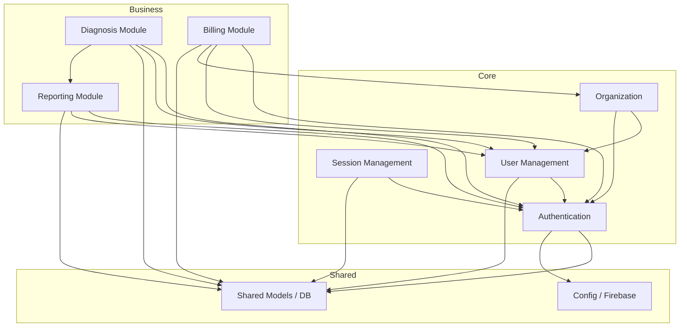
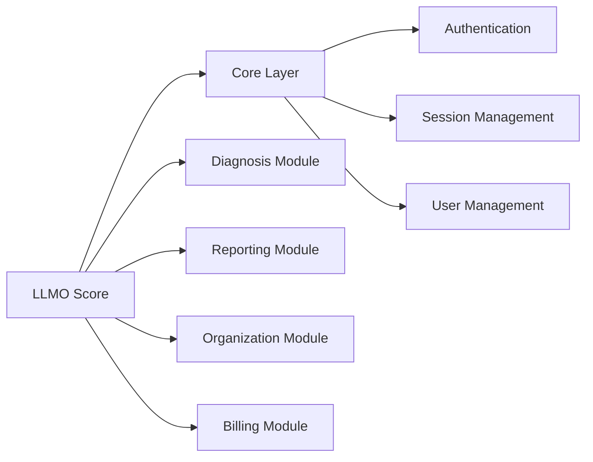
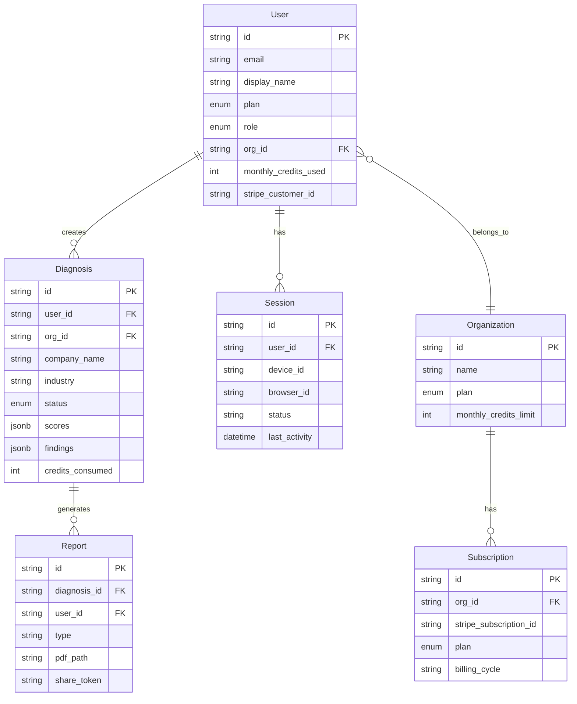
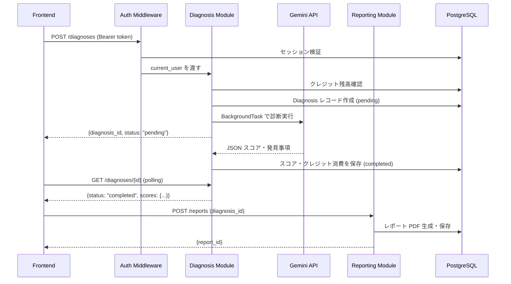

# LLMO Score — モジュールアーキテクチャ設計書

## 1. 機能一覧とモジュール分類

| 機能 | モジュール | レイヤー |
|---|---|---|
| Firebase認証・トークン検証 | Authentication | Core |
| セッション作成・破棄 | Authentication / Session Management | Core |
| 複数接続検知・制御 | Session Management | Core |
| ユーザープロフィール管理 | User Management | Core |
| チーム招待・ロール管理 | Organization | Business |
| Stripe課金・サブスク管理 | Billing | Business |
| AI診断実行（Gemini） | Diagnosis | Business |
| PDFレポート生成・配信 | Reporting | Business |
| 請求履歴・クレジット管理 | Billing | Business |
| ダッシュボードサマリー | User Management | Business |

## 2. モジュール依存関係



## 3. アプリ構成定義

```
LLMO Score = Core + Diagnosis + Reporting + Organization + Billing
```



## 4. モジュール別 API 仕様

### Core: Authentication Module

| Method | Path | 説明 |
|---|---|---|
| POST | /auth/signup | 新規登録（Firebase IDトークン） |
| POST | /auth/login | ログイン（複数接続チェック） |
| POST | /auth/logout | ログアウト（セッション無効化） |

### Core: Session Management Module

| Method | Path | 説明 |
|---|---|---|
| GET | /users/sessions | アクティブセッション一覧 |
| DELETE | /users/sessions/{id} | セッション個別無効化 |

### Core: User Management Module

| Method | Path | 説明 |
|---|---|---|
| GET | /users/me | 自分の情報取得 |
| PATCH | /users/me | プロフィール更新 |
| GET | /users/dashboard | ダッシュボードサマリー |
| POST | /users/team/invite | チームメンバー招待 |

### Business: Diagnosis Module

| Method | Path | 説明 |
|---|---|---|
| POST | /diagnoses | 新規診断実行 |
| GET | /diagnoses | 診断一覧取得 |
| GET | /diagnoses/{id} | 診断詳細取得 |

### Business: Reporting Module

| Method | Path | 説明 |
|---|---|---|
| POST | /reports | レポート生成 |
| GET | /reports | レポート一覧 |
| GET | /reports/{id}/download | PDFダウンロード |
| POST | /reports/{id}/share | 共有リンク生成 |

### Business: Billing Module

| Method | Path | 説明 |
|---|---|---|
| POST | /billing/checkout | Stripe Checkoutセッション作成 |
| POST | /billing/credits | クレジット追加購入 |
| POST | /billing/portal | Stripe顧客ポータル |
| GET | /billing/info | 請求情報取得 |
| POST | /billing/webhook | Stripe Webhook受信 |

### Business: Organization Module

| Method | Path | 説明 |
|---|---|---|
| GET | /organization | 組織情報取得 |
| PATCH | /organization | 組織情報更新 |
| GET | /organization/members | メンバー一覧 |

## 5. データベーススキーマ（SQLAlchemy モデル）



## 6. ディレクトリ構成

### Backend

```
backend/
├── core/                           # 設定・外部サービス接続
│   ├── config.py                   # 環境変数・設定
│   └── firebase.py                 # Firebase Admin SDK
│
├── shared/                         # 全モジュール共通
│   └── models.py                   # SQLAlchemy モデル（再エクスポート）
│
├── models/                         # DB基盤（既存・互換維持）
│   ├── database.py                 # AsyncSession, Base, engine
│   └── models.py                   # 全テーブル定義
│
├── middleware/
│   └── auth_middleware.py          # Firebase JWT 検証 Depends
│
├── modules/                        # ★ モジュール層（新規）
│   ├── authentication/             # Core: ログイン・セッション
│   │   ├── schemas.py
│   │   ├── service.py
│   │   └── router.py
│   ├── session_management/         # Core: セッション管理
│   │   └── router.py
│   ├── user_management/            # Core: ユーザー管理
│   │   ├── schemas.py
│   │   └── router.py
│   ├── organization/               # Business: 組織管理
│   │   └── router.py
│   ├── diagnosis/                  # Business: AI診断
│   │   ├── schemas.py
│   │   ├── service.py
│   │   └── router.py
│   ├── reporting/                  # Business: レポート生成
│   │   ├── schemas.py
│   │   ├── service.py
│   │   └── router.py
│   └── billing/                    # Business: 課金・Stripe
│       ├── schemas.py
│       └── router.py
│
├── routers/                        # 互換シム（既存ファイルは新モジュールへ委譲）
│   ├── auth.py                     # → modules.authentication.router
│   ├── users.py                    # → modules.user_management.router
│   ├── diagnoses.py                # → modules.diagnosis.router
│   ├── reports.py                  # → modules.reporting.router
│   └── billing.py                  # → modules.billing.router
│
├── services/                       # 互換シム（新モジュールへ委譲）
│   ├── auth_service.py             # → modules.authentication.service
│   ├── diagnosis_service.py        # → modules.diagnosis.service
│   └── report_service.py           # → modules.reporting.service
│
└── main.py                         # アプリ構成（modules から router を登録）
```

### Frontend

```
frontend/
├── app/                            # Next.js App Router
│   ├── (auth)/                     # 認証ページ
│   ├── dashboard/
│   │   ├── diagnoses/              # Diagnosis Module UI
│   │   ├── reports/                # Reporting Module UI
│   │   ├── billing/                # Billing Module UI
│   │   └── settings/               # User Management / Organization UI
│   ├── pricing/                    # LP
│   ├── features/                   # LP
│   ├── blog/                       # LP
│   └── contact/                    # LP
│
├── components/
│   ├── core/
│   │   ├── auth/                   # 認証関連UI（MultipleConnectionWarning）
│   │   ├── sidebar/                # Sidebar ナビゲーション
│   │   └── navbar/                 # トップナビゲーション
│   └── modules/
│       ├── diagnosis/              # DiagnosisCard, DiagnosisStatus など
│       ├── reporting/              # ReportCard, ScoreBar など
│       ├── billing/                # PlanBadge, InvoiceRow など
│       └── organization/           # MemberRow, RoleBadge など
│
└── lib/
    ├── api/
    │   ├── core/                   # auth.ts, users.ts, sessions.ts
    │   └── modules/                # diagnosis.ts, reporting.ts, billing.ts
    ├── types/
    │   ├── core.ts                 # User, Session 型
    │   └── modules.ts              # Diagnosis, Report, Billing 型
    ├── auth-context.tsx
    ├── firebase.ts
    └── utils.ts
```

## 7. 将来分離可能なモジュール

| モジュール | 分離難易度 | 用途例 |
|---|---|---|
| Diagnosis Module | ★☆☆ 低 | AI診断SaaS汎用基盤 |
| Billing Module | ★★☆ 中 | 従量課金SaaS基盤 |
| Reporting Module | ★★☆ 中 | レポート自動生成プラットフォーム |
| Organization + User Management | ★★☆ 中 | CRM・エンタープライズ管理 |

## 8. モジュール間通信フロー（診断実行）


