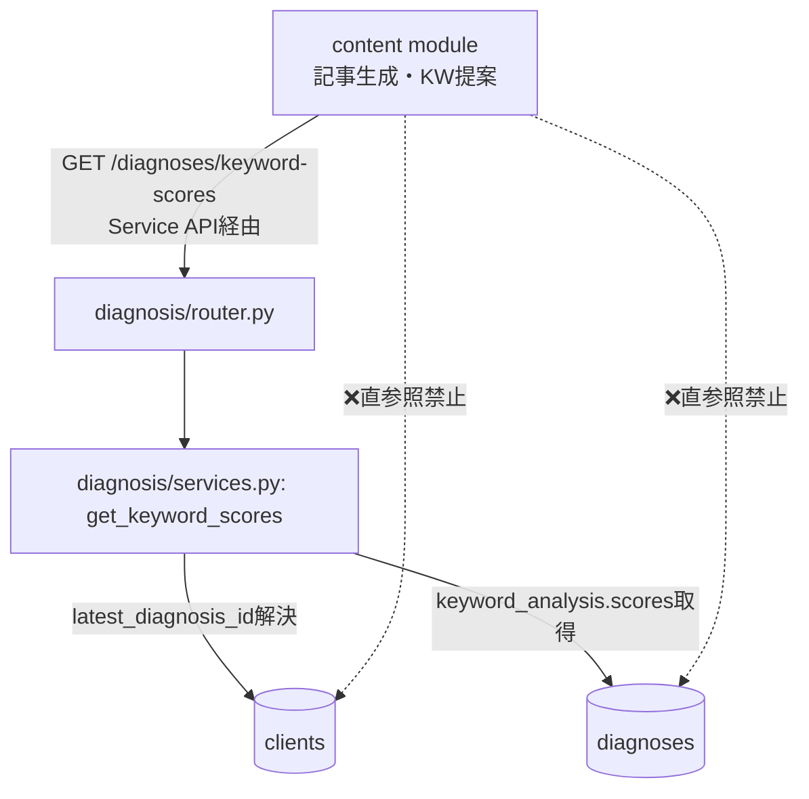

# 設計書：最新診断のキーワードスコア取得 Service API（②キーワード診断連動の基盤）

**作成日**: 2026-06-25
**対象モジュール**: diagnosis（新エンドポイント追加。content側の利用は本設計では仕様記載のみ、実装は次段）
**SSOT整合**: `LLMO-Score-COMPLETE-FINAL-v4.md` / `docs/session_log.md`
**承認状態**: ひさ承認待ち → 承認後にClaude Code実装指示へ
**位置づけ**: コンテンツUX改善②（キーワード自動生成・診断連動型）の土台。デザイン非依存のため先行実装可能

---

## 0. 背景と目的

記事生成のターゲットキーワードを「診断で弱かったキーワードから提案」するには、
content モジュールがクライアントの最新診断のキーワード別スコアを取得する必要がある。

現状、専用APIが無く、取得には `GET /clients/{id}` → `latest_diagnosis_id` →
`GET /diagnoses/{id}` → `keyword_analysis.scores` の **FE側2段階fetch** が要る。
これは content が diagnosis の内部構造（latest_diagnosis_id→keyword_analysis.scores）を
知ることになり、モジュール疎結合に反する。

本設計は diagnosis モジュールに **専用Service API を1本追加**し、
content は1コールでスコアを取得できるようにする（DB直参照・内部構造依存を排除）。

**設計方針（確定済み）**: 生データを返すだけ。ソート・弱点判定・推奨は content 側の責務。
diagnosis は「事実（キーワードとスコア）」のみ返し、用途を知らない。
→ content だけでなく optimization 等でも同じAPIを再利用可能。

---

## 1. 確定した現物（調査結果サマリー）

| 項目 | 確認結果 |
|------|---------|
| `keyword_analysis` 構造 | `{"scores": {keyword_str: int}}` フラット1段。値はint 0〜100 |
| 実データ例 | 福井スイーツ:67, 福井カフェ:83, green parlour ベルベール:83 等 |
| `clients.latest_diagnosis_id` | 信頼可能。status='completed'時のみ更新（failedは上書きしない＝正しい） |
| ⚠️ simple診断のリスク | simpleは`keyword_analysis=None`で完了 → latestがsimpleだとscores=null |
| 命名規約 | router: `動詞_エンティティ`（get_diagnosis）/ service: 短縮（_svc.get） |
| 既存route | `GET /diagnoses`（list）, `GET /diagnoses/{diagnosis_id}`（単件） |
| content繋ぎ込み先 | `POST /contents/articles`。今は`diagnosis_id`→findings[0:3].titleのみ使用。scores未使用 |

---

## 2. モジュールアーキテクチャ（疎結合）

```
Business Module: diagnosis  ← 今回変更（新エンドポイント追加）
Business Module: content    ← 本APIの利用者（実装は次段。本設計では仕様のみ）
```

### 2.1 依存関係（DB直参照禁止の遵守）



content は clients/diagnoses テーブルを直接見ない。必ず本APIを叩く。
「latest_diagnosis_id を解決する手順」は diagnosis 内部に閉じ込める（漏らさない）。

---

## 3. API仕様

### 3.1 エンドポイント

```
GET /api/diagnoses/keyword-scores?client_id={client_id}
認証: get_current_user（既存と同じ。agency_id でスコープ）
```

### 3.2 🔴 route定義順序（FastAPIの地雷・必須）

`GET /diagnoses/{diagnosis_id}` が既存にある。FastAPIは上から順マッチのため、
**`/keyword-scores` を `/{diagnosis_id}` より前に定義しないと**、
`/keyword-scores` が `diagnosis_id="keyword-scores"` として吸い込まれ404になる。

```python
# router.py の定義順（厳守）
@router.get('/keyword-scores', ...)   # ← 必ず先
async def get_keyword_scores(...): ...

@router.get('/{diagnosis_id}', ...)   # ← 後
async def get_diagnosis(...): ...
```

※これは §5「バグの一族」に新類型として追加すべき（route順序によるパスパラメータ吸い込み）。

### 3.3 レスポンス

**正常（最新がdetailed診断・scoresあり）**
```json
{
  "diagnosis_id": "9f3ee663-6db7-4e2d-b09a-3c940b5be989",
  "diagnosis_type": "detailed",
  "scores": {"福井 スイーツ": 67, "福井 カフェ": 83, "ベルベール 福井": 67},
  "diagnosed_at": "2026-06-25T..."
}
```

**スコア無し（診断が無い / 最新がsimpleでkeyword_analysis=null）**
```json
{
  "diagnosis_id": null,
  "diagnosis_type": null,
  "scores": {},
  "diagnosed_at": null
}
```

- **404にしない。** 空の `scores: {}` を200で返す。content側が「空ならフォールバック」と判定できるようにするため。
- ソートしない（生データ）。並べ替え・弱点判定は呼び出し側。

### 3.4 サービスロジック（services.py）

```
get_keyword_scores(client_id, agency_id):
  1. client = clients取得（agency_id一致を確認＝他代理店のデータ遮断）
  2. latest_id = client.latest_diagnosis_id
     - None → 空レスポンス返す（診断未実施）
  3. diag = diagnoses取得(latest_id)
  4. ka = diag.keyword_analysis
     - None or scores無し（simpleケース）→ 空レスポンス（scores={}）+ diagnosis_idは返す
  5. scores = ka['scores']（{str:int}）をそのまま返す
```

### 3.5 セキュリティ

- agency_id で必ずスコープ。他代理店のクライアントの client_id を渡されても、
  client.agency_id 不一致なら空（または403）。**親子アカウント越境を防ぐ**（§5教訓）。
- 判断: 存在しない/他代理店の client_id は **空レスポンス**で統一（情報漏洩防止のため404と区別しない）。

---

## 4. content側の利用仕様（参考・実装は次段の別設計）

本APIが土台。content の②実装時はこう使う（diagnosisモジュールは関知しない）：

```
記事生成画面の「✨AIで自動生成」ボタン押下:
  1. GET /diagnoses/keyword-scores?client_id=xxx でscores取得
  2. 【content側で】scores昇順ソート（低スコア=弱点を上位に）
  3. 候補提示「福井スイーツ（67・要強化）」のように弱点を明示
  4. scores が {} なら /keywords/suggest（プロフィール生成）にフォールバック
  5. ユーザーは候補を編集・追加・削除可（手動入力も併存＝ハイブリッド）
```

ソート・弱点ラベル・推奨は **content の責務**（diagnosisは生データのみ）。

---

## 5. 実装範囲と非範囲

**範囲（このタスク）**
- diagnosis schemas: `KeywordScoresResponse` 追加
- diagnosis router: `GET /diagnoses/keyword-scores`（**/{diagnosis_id}より前に定義**）
- diagnosis services: `get_keyword_scores(client_id, agency_id)`
- simple/診断無しの空レスポンス処理、agency_idスコープ

**非範囲（別タスク）**
- content側のボタンUI・ソート・フォールバック（②本体・デザイン依存・次段）
- 一次情報テンプレート（①・別設計）
- `POST /contents/articles` での scores 活用拡張（現状findings.titleのみ。②完成後に検討）

---

## 6. テスト・検証

| ケース | 期待 |
|--------|------|
| detailed診断ありのclient | scores返る（{str:int}） |
| 診断無しのclient | `{diagnosis_id:null, scores:{}}` 200 |
| 最新がsimple診断のclient | `{diagnosis_id:<simple_id>, scores:{}}` 200（404にしない） |
| 他代理店のclient_id | 空レスポンス（越境不可） |
| route順序 | `/keyword-scores` が `/{diagnosis_id}` に吸われず正しく解決 |

---

## 7. 将来の再利用

「最新診断のスコアを1コールで取得」は content 専用ではない：
- optimization：診断の弱点に連動した最適化提案
- automation：定期診断のスコア推移モニタリング
- reporting：スコアサマリー表示

生データを返す設計なので、各モジュールが自分の用途でソート・加工できる。

---

## 8. session_log 記載（実装着手時に追記する予定文）

```
## Session 2026-06-25（夜）
### 作業内容（予定）
- diagnosisモジュールに最新診断キーワードスコア取得API追加（②の基盤）
- GET /diagnoses/keyword-scores?client_id=... （/{diagnosis_id}より前に定義＝route吸い込み防止）
- 生データ返却（ソート・弱点判定はcontent側）。simple/診断無しは空scores 200
- agency_idスコープで越境遮断
- 非範囲: content側UI・①テンプレート
```
