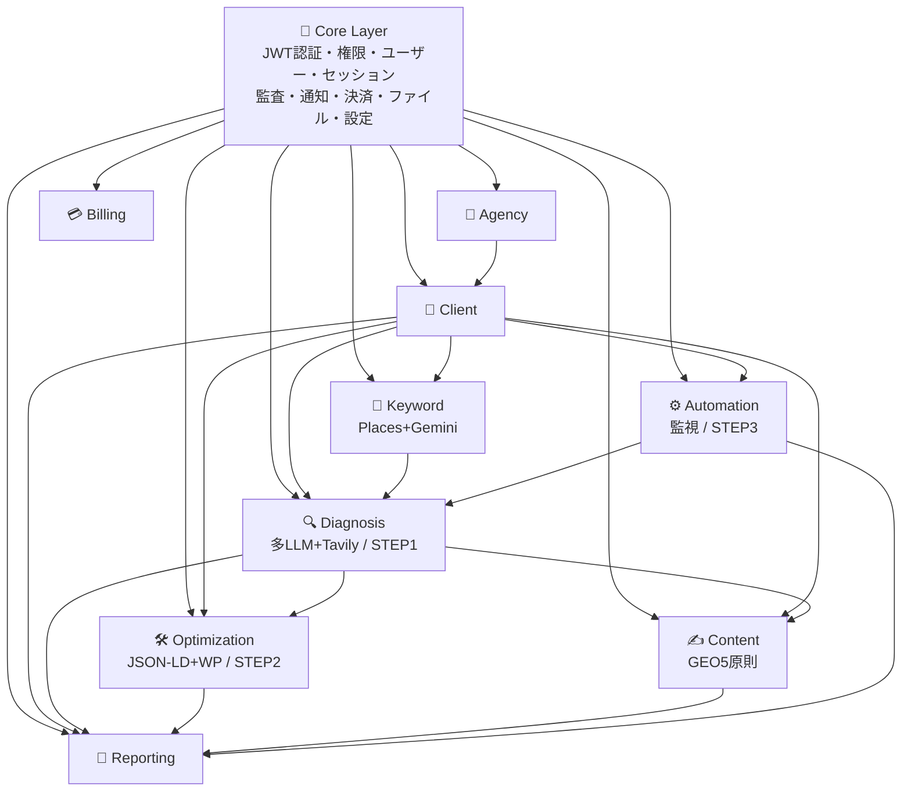

# LLMO Score - 完全版設計書 v4.1（再構築版）

**プロジェクト名**: LLMO Score
**バージョン**: 4.1（再構築版・SSOT）
**作成日**: 2026-06-22
**更新日**: 2026-06-23
**変更履歴**: v4.1 — Phase 7（Automation）確定仕様を反映（ハルシネーション判定・クレジット挙動・スケジューラ方式・月次レポート・通知先解決）
**設計方針**: B2B SaaS 代理店モデル × モジュールアーキテクチャ × 3ステップ一気通貫
**最終目標**: 代理店がワンオペで、クライアントの「AI検索認知度（LLMO）」を**診断 → 実装 → 監視**まで一気通貫で運用できるツール

> 本書は旧設計書（`LLMO-Score-COMPLETE-FINAL.md`）と現行実装（v3.0.0）の議論を統合し、差別化のなかった旧診断（Gemini単体問い合わせ）を技術的に高度な3ステップ構成へ作り直すための単一の正本（SSOT）である。

---

# 第0章: 本設計書の位置づけと確定事項

## 0.1 旧設計の問題点（再掲）

旧設計および現行 v3.0.0 の診断は「Gemini に "このURLの会社について教えて" と聞くだけ」であり、**誰でも再現可能＝差別化ゼロ**だった。本書はこれを次の3ステップへ作り直す。

```
STEP 1: 診断（見込み客獲得・自動）       → フロントエンド集客
STEP 2: 実装最適化（一時金・半自動）     → 一時収入
STEP 3: 監視・保守（月額・全自動）        → ストック収入
```

## 0.2 今回の確定事項（v4.0で固めた判断）

| # | 項目 | 確定内容 |
|---|------|----------|
| 1 | アーキテクチャ | Next.js + FastAPI のフルカスタム SaaS（ノーコード不採用） |
| 2 | 稼働環境 | VPS（116.80.96.175 / llmo.fact-ally.com）上に **Docker / docker-compose** で全構成を自己ホスト |
| 3 | データベース | **PostgreSQL（Docker）**。Firestore は廃止 |
| 4 | 認証 | **自前 JWT 認証（v1/v2方式）を Docker 運用**。Firebase（Auth/Firestore）は完全に外す |
| 5 | 診断エンジン | **Google Gemini 2.5 + OpenAI GPT-4o の2社同時クエリ**（Claude / Perplexity は不採用） |
| 6 | Web情報取得 | **Tavily API**（実クロール・グラウンディング） |
| 7 | 実装最適化（STEP2） | JSON-LD自動生成 + **WordPressプラグイン（Yoast SEO / Schema Pro）プリセット配布** |
| 8 | AIOコンテンツ制作（③） | **8番目のBusiness Module（Content Module）として正式組込み** |
| 9 | 通知 | メール（SendGrid）+ Slack Webhook + **LINE Messaging API**（LINE Notifyは2025/3終了のため不使用） |
| 10 | 移行方針 | 現行 v3.0.0 の使える資産を最大限再利用し、差し替えは「認証/データアクセス層」に限定（第10章） |

## 0.3 現行 v3.0.0 との関係

現行は Core + 7 Business Module の骨格、親子アカウント、セッション制御、Stripe、PDF、クレジット管理まで稼働済み。本書はこれを土台に、(a) 認証/DBの自己ホスト化、(b) Diagnosis の多LLM＋クロール化、(c) Optimization / Content / Automation の新設・強化を行う**差分リファクタ計画**として読む。詳細は第10章。

---

# 第1章: ビジネスモデル

## 1.1 全体構造

```
あなた（LLMO Score 開発・運営）
  ↓ ツール提供（代理店向け月額サブスク）
Web制作会社（代理店）
  ↓ 営業・提案・運用
中小企業・店舗（クライアント）
  ↓ 月額料金支払い → 代理店 → あなたへライセンス料

※ クライアントはアプリにログインしない。代理店従業員が代行運用する。
```

## 1.2 3ステップ一気通貫モデル（本プロダクトの核）

| STEP | モード | 自動化度 | 課金 | 担当モジュール |
|------|--------|----------|------|----------------|
| 1 | 診断（AI認知度診断） | 自動 | クレジット | Diagnosis + Keyword |
| 2 | 実装最適化 | 半自動 | 一時金（クレジット） | Optimization |
| — | AIOコンテンツ制作 | 半自動 | 一時金/月額 | Content |
| 3 | 監視・保守 | 全自動 | 月額 | Automation |

```
顧客体験の一貫性:
「最初に無料診断したシステムが、そのまま自社専用のAI対策ダッシュボードになる」

1. 診断で見込み客を捕まえる（自動）
2. 実装・コンテンツで一時金をいただく（半自動）
3. 監視で月額費用をいただく（全自動）
→ 代理店は「AIが出した結果の最終チェック」と「顧客への解説」に集中できる。
```

## 1.3 代理店のメリット

```
BEFORE: 手動でLLMO分析 → 1社2-3時間 × 月1回 × 10社 = 月20-30時間
AFTER:  ダッシュボードで「診断実行」クリック → 1社5分 × 10社 = 50分
        キーワード提案・実装コード・月次レポートまで自動
        HP管理料 > サブスク料金 = 利益
```

---

# 第2章: ユーザー・ロール・アカウント設計

## 2.1 ユーザー階層

```
System Owner（あなた）
  └ 代理店（Agency）= 契約者
      ├ Admin（親）  = 課金・プラン・子アカウント管理・全クライアント閲覧
      ├ Staff（子）  = 診断・キーワード・実装・コンテンツ・レポート実行
      └ Viewer（子） = レポート閲覧のみ
          └ クライアント（Client）= 代理店の顧客（ログインしない）
```

## 2.2 ロール・権限マトリクス

```
操作                     | Admin | Staff | Viewer
-------------------------|-------|-------|-------
クライアント追加/編集    | ✅    | ✅    | ❌
クライアント削除         | ✅    | ❌    | ❌
診断実行                 | ✅    | ✅    | ❌
キーワード生成           | ✅    | ✅    | ❌
実装最適化生成           | ✅    | ✅    | ❌
AIOコンテンツ生成        | ✅    | ✅    | ❌
レポート閲覧/DL          | ✅    | ✅    | ✅
レポート配信設定         | ✅    | ✅    | ❌
監視（自動実行）設定     | ✅    | ✅    | ❌
課金・プラン変更         | ✅    | ❌    | ❌
子アカウント管理         | ✅    | ❌    | ❌
クレジット配分           | ✅    | ❌    | ❌
APIキー管理              | ✅    | ❌    | ❌
```

## 2.3 セッション管理

```
親/各子アカウント = それぞれ同時1ブラウザのみ
✅ Admin + 子1 + 子2 + 子3 = 4人同時ログインOK
❌ 同一子が PC Chrome + iPad Safari = NG（警告 → ユーザー選択で旧セッション失効）
同一ブラウザの複数タブ = セッション共有（警告なし）
```

---

# 第3章: 課金設計

## 3.1 プラン比較表（確定・据え置き）

```
                        | Starter      | Pro          | Enterprise
------------------------|--------------|--------------|----------------
基本月額                | 15,000円     | 30,000円     | 80,000円
年払い（10%割引）       | 162,000円    | 324,000円    | 864,000円
含まれる子アカウント    | 2名          | 5名          | 15名
1子あたりクレジット/月  | 100          | 200          | 500
代理店全体クレジット/月 | 200          | 1,000        | 7,500
子アカウント追加        | 3,000円/名   | 2,500円/名   | 2,000円/名
子アカウント上限        | 5名          | 15名         | 無制限
クライアント上限        | 10社         | 30社         | 100社
クライアント追加        | 不可         | 1,000円/社   | 500円/社
簡易レポート            | ✅           | ✅           | ✅
詳細レポート            | ❌           | ✅           | ✅
キーワードレポート      | ❌           | ✅           | ✅
実装最適化（STEP2）     | ❌           | ✅           | ✅
AIOコンテンツ制作       | ❌           | ✅           | ✅
代理店ブランディング    | ❌           | ✅           | ✅
監視自動実行（STEP3）   | 5社まで      | 30社まで     | 100社まで
Slack統合               | ❌           | ❌           | ✅
LINE通知                | ❌           | ✅           | ✅
API                     | ❌           | ❌           | ✅
```

## 3.2 クレジット消費表

> 既存値は確定。**多LLM化・新機能ぶんは「暫定（要確認）」**。単価は API 原価（Gemini + GPT-4o + Tavily）を踏まえ運用後に微調整する。

```
操作                          | 消費cr | 状態
------------------------------|--------|----------------
キーワード生成                | 3      | 確定
簡易診断（Gemini単体・要約）  | 5      | 確定
詳細診断（多LLM+Tavily+引用） | 20     | 暫定（旧15→多LLM化で増）
実装最適化生成（STEP2一式）   | 10     | 暫定（新規）
AIOコンテンツ生成（1記事）    | 12     | 暫定（新規）
簡易レポートPDF               | 2      | 確定
詳細レポートPDF               | 5      | 確定
キーワードレポートPDF         | 3      | 確定
監視1回（週次・多LLM）        | 6      | 暫定（新規）
月次自動実行（1社・多LLM）    | 12     | 暫定（旧8→多LLM化で増）
```

## 3.3 アップグレード誘導

```
Starter→Pro: 子3名追加=24,000円 → Proなら30,000円でクレジット2倍+詳細/実装/コンテンツ解放
Pro→Enterprise: 子10名追加=55,000円 → Entなら80,000円でクレジット2.5倍+Slack+API
```

---

# 第4章: モジュールアーキテクチャ設計

## 4.1 3層構成

### Layer 1: Core（共通基盤・全モジュール共有）

| # | モジュール | 責務 |
|---|-----------|------|
| 1 | Authentication | 自前JWT発行・検証・リフレッシュ（Firebase廃止） |
| 2 | Authorization | ロール・権限（Admin/Staff/Viewer） |
| 3 | User Management | ユーザープロフィール |
| 4 | Session Management | セッション・複数接続制御 |
| 5 | Audit Log | 全操作の監査証跡 |
| 6 | Notification | メール/Slack/**LINE**/アプリ内通知 |
| 7 | Payment | Stripe統合・サブスク・Webhook |
| 8 | File Management | PDF・ファイル保存（VPSローカル or S3互換） |
| 9 | Settings | アプリ/システム設定 |

### Layer 2: Business Modules（9モジュール）

| # | モジュール | 責務 | STEP |
|---|-----------|------|------|
| A | Agency | 代理店管理・契約・ブランディング | — |
| B | Client | クライアント・URL管理 | — |
| C | Diagnosis | 多LLM診断・引用スコア（技術的コア） | 1 |
| D | Keyword | キーワード生成・Google Places競合分析 | 1 |
| E | **Optimization** | JSON-LD/紹介文/robots/FAQ/WPプリセット生成 | 2 |
| F | **Content** | GEO5原則のAIOライティング・一次情報読込 | — |
| G | Reporting | レポート生成・PDF・ブランディング・配信 | 全 |
| H | Billing | 親子アカウント・クレジット・Stripe | — |
| I | Automation | 監視スケジューラ・差分/ハルシネーション検知・配信 | 3 |

### Layer 3: Application Composition

```
LLMO Score = Core(9) + Agency + Client + Diagnosis + Keyword
                     + Optimization + Content + Reporting + Billing + Automation
```

## 4.2 モジュール依存図



**疎結合の原則**: モジュール間の通信は必ず各モジュールの公開 Service API を経由する。他モジュールの DB テーブルへの直接参照は禁止。

## 4.3 推奨フォルダ構成（Docker / PostgreSQL 前提）

```
llmo-score/
├── docker-compose.yml          # api / web / db / worker / nginx
├── .env                        # 全シークレット集中管理
│
├── backend/
│   ├── Dockerfile
│   ├── requirements.txt
│   ├── CLAUDE.md
│   ├── docs/
│   │   ├── architecture/module-plan.md
│   │   └── session_log.md
│   └── app/
│       ├── main.py
│       ├── config.py
│       ├── core/
│       │   ├── authentication/   # ← 自前JWT（Firebase廃止）
│       │   ├── authorization/
│       │   ├── user_management/
│       │   ├── session_management/
│       │   ├── audit_log/
│       │   ├── notification/     # email / slack / line
│       │   ├── payment/
│       │   ├── file_management/
│       │   └── settings/
│       ├── modules/
│       │   ├── agency/
│       │   ├── client/
│       │   ├── diagnosis/        # ← 多LLM+Tavilyへ再設計
│       │   ├── keyword/
│       │   ├── optimization/     # ← 新設（STEP2）
│       │   ├── content/          # ← 新設（③）
│       │   ├── reporting/
│       │   ├── billing/
│       │   └── automation/       # ← 監視/差分/通知へ強化（STEP3）
│       └── shared/
│           ├── db/               # SQLAlchemy engine / session / Base
│           ├── llm/              # 多LLMオーケストレータ（Gemini/GPT-4o共通I/F）
│           ├── api/              # 共通APIユーティリティ
│           ├── utils/
│           └── constants/
│
└── frontend/
    ├── Dockerfile
    └── app/
        ├── (auth)/{login,signup}/
        └── dashboard/
            ├── clients/ diagnoses/ keywords/
            ├── optimizations/   # 新設
            ├── contents/        # 新設
            ├── reports/ billing/ automation/ settings/
        # デザインは melta-ui トークン準拠（独自デザイン生成禁止）
```

各モジュールは `__init__.py / models.py / schemas.py / services.py / router.py` の独立フォルダ構成とする。

---

# 第5章: Core Layer 詳細設計

> データモデルは PostgreSQL テーブル表記。`PK`=主キー、`FK`=外部キー。

### 5.1 Authentication Module（★Firebase廃止・自前JWT）

**責務**: メール+パスワード認証、JWT（access/refresh）発行・検証、パスワードリセット。
**保持データ**:
```
users(id PK, email UNIQUE, password_hash, email_verified, created_at)
email_confirmations(id PK, user_id FK, token, expires_at)
password_reset_tokens(id PK, user_id FK, token, expires_at)
```
**公開API**: `signup(email,password)→{user_id}` / `login(email,password)→{access,refresh}` / `refresh(token)→{access}` / `verifyEmail(token)` / `resetPassword(email)`
**依存**: なし　**外部**: bcrypt/argon2, PyJWT　**再利用例**: 全自己ホストSaaSの認証基盤

### 5.2 Authorization Module
**責務**: ロール・権限判定。**保持**: `roles`, `permissions`（or Agency側 role 列を参照）。
**公開API**: `hasPermission(user_id,resource,action)→bool` / `getUserRoles(user_id)`　**依存**: User Management

### 5.3 User Management Module
**責務**: プロフィール管理。**保持**: `user_profiles(user_id PK FK, name, avatar_url, ...)`
**公開API**: `getUser/updateUser/deleteUser`　**依存**: Authentication

### 5.4 Session Management Module
**責務**: セッション発行・複数接続制御。
**保持**:
```
sessions(id PK, user_id FK, agency_id FK, role,
         browser_name, browser_version, os, ip_address,
         access_token_expires_at, refresh_token_expires_at,
         last_activity, status, revoke_reason, created_at)
```
**公開API**: `createSession` / `getActiveSessions` / `revokeSession` / `checkMultipleConnection(user_id,browser_id)→{is_multiple,existing}`
**特別ルール**: 子アカウントごと独立セッション、同一アカウントは同時1ブラウザ。

### 5.5 Audit Log Module
**保持**: `audit_logs(id PK, user_id FK, action, resource_type, resource_id, details JSONB, created_at)`
**公開API**: `recordLog` / `getAuditLog(filter)`

### 5.6 Notification Module（★LINE追加）
**責務**: メール（SendGrid）・Slack Webhook・**LINE Messaging API（push）**・アプリ内通知。
**保持**: `notifications`, `notification_channels(agency_id FK, type[email|slack|line], config JSONB)`
**公開API**: `sendEmail` / `sendSlack(channel,msg)` / `sendLine(to,messages[])` / `sendInApp(user_id,msg)`
**注意**: LINE Notify は 2025/3 終了。LINE Messaging API（公式アカウント必須・無料枠 月200通）を使用。

### 5.7 Payment Module
**責務**: Stripe顧客/サブスク/Webhook。**保持**: `stripe_customers`, `stripe_subscriptions`, `webhook_events`
**公開API**: `createCheckoutSession` / `getSubscription` / `cancelSubscription` / `handleWebhook`

### 5.8 File Management Module
**責務**: PDF等の保存（VPSローカル or S3互換ストレージ）・署名URL発行。
**保持**: `files(id PK, owner_id FK, path, mime, size, created_at, expires_at)`
**公開API**: `saveFile` / `getFileUrl(file_id)` / `deleteFile`

### 5.9 Settings Module
**保持**: `app_settings(agency_id FK, key, value JSONB)`　**公開API**: `getSettings/updateSettings`

---

# 第6章: Business Modules 詳細設計

### Module A: Agency
**責務**: 代理店登録・プラン・ブランディング・メンバー管理。
**保持**:
```
agencies(id PK, name, owner_user_id FK, plan, billing_cycle, status,
         included_child_accounts, max_child_accounts, credits_per_child,
         included_clients, branding JSONB{logo_url,primary_color,contact_email},
         stripe_customer_id, created_at)
agency_members(id PK, agency_id FK, user_id FK, role, status, joined_at)
```
**公開API**: `createAgency` / `getAgency` / `updateAgency` / `addStaff` / `removeStaff` / `getMembers` / `getStats`
**依存**: Core　**再利用例**: マルチテナント/代理店管理SaaS

### Module B: Client
**責務**: クライアント企業・URL・担当紐付け。
**保持**:
```
clients(id PK, agency_id FK, name, url, industry, prefecture, city,
        contact_name, contact_email, contact_phone, notes,
        assigned_staff_ids JSONB, status,
        settings JSONB{auto_enabled,auto_day,report_email,report_slack,report_line},
        latest_diagnosis_id, latest_score, created_by, created_at)
```
**公開API**: `createClient` / `getClient` / `updateClient` / `deleteClient` / `getClientsByAgency(filter)` / `getClientStats`
**依存**: Core, Agency　**再利用例**: CRM/顧客管理

### Module C: Diagnosis（★STEP1・技術的コア・再設計）
**責務**: 対象URL+キーワードに対し、Tavilyで実Web情報を取得し、**Gemini 2.5 と GPT-4o に同時クエリ**、各AIの認識を比較して**引用スコア**を算出。サイト構造分析を併せて行う。
**保持**:
```
diagnoses(id PK, client_id FK, agency_id FK, executed_by FK,
          target_url, industry, location, selected_keywords JSONB,
          mode[simple|detailed], status, credits_consumed, created_at,
          scores JSONB{overall,ai_awareness,competitive,geo,eeat,growth},
          ai_analysis JSONB,            -- AI別 mention 結果（下記）
          keyword_analysis JSONB,       -- キーワード別スコア
          site_analysis JSONB,          -- schema/robots/sitemap/faq/ssl/speed
          findings JSONB{strengths,weaknesses,opportunities},
          recommendations JSONB,        -- priority/category/action/impact/timeline
          projections JSONB{six_month,twelve_month},
          raw_evidence JSONB,           -- Tavily取得本文・各AI生回答（監査/RAG用）
          source ENUM('manual','automation_monthly','automation_weekly') DEFAULT 'manual')
                                        -- 実行起点の種別（月次レポート集約・監視差分基準に使用）
```
> **source 列の運用ルール（v4.1 確定）**
> - 既存行・手動診断（既存 router 経由）は `default='manual'` に倒れる。Diagnosis 本体のロジックは変更しない。
> - `source` を明示セットするのは **Automation の execute() のみ**（書き込み側の責務）。月次自動実行は `automation_monthly`、週次監視は `automation_weekly` を渡す。
> - 月次レポートの「年月ごと代表値集約」（Module G）と、監視の差分基準特定に使用する。

**ai_analysis の構造**:
```
{ "gemini": {"mention":"mentioned|partial|not", "quality":0-3, "context":"...", "raw":"..."},
  "gpt4o":  {"mention":"mentioned|partial|not", "quality":0-3, "context":"...", "raw":"..."} }
```
**公開API**: `runDiagnosis(client_id,keywords[],mode)→{diagnosis_id}` / `getDiagnosis` / `getByClient` / `getByAgency(filter)` / `compareDiagnoses(id1,id2)`
**依存**: Core, Client, Keyword　**外部**: Gemini API, OpenAI API, Tavily API
**再利用例**: AI可視性計測SaaS、SEO/HR/ブランド診断（Visiblie / Brand UP / Answer IO 同等の精度を狙う）
> 引用スコアの算出仕様は第7章 7.1。

### Module D: Keyword
**責務**: Google Places で地域内競合を分析し、Gemini で「実際に検索されるキーワードTOP15」を生成。提案理由・競合使用状況を明示。
**保持**:
```
keyword_sets(id PK, client_id FK, agency_id FK, generated_by FK,
             industry, prefecture, city, target_url,
             competitor_data JSONB,  -- name/address/summary/types/source
             keywords JSONB,         -- rank/keyword/search_volume/relevance/category/reason/competitor_usage/recommendation
             market_analysis JSONB, created_at)
```
**公開API**: `generateKeywords(client_id)` / `suggestKeywords(client_id)`（クレジット消費なしの簡易補助）/ `getKeywordSet` / `getByClient` / `regenerate` / `exportKeywordReport`
**依存**: Core, Client　**外部**: Google Places API, Gemini API　**再利用例**: SEOキーワードツール

### Module E: Optimization（★STEP2・新設）
**責務**: 診断結果と対象サイトのスクレイピングをもとに、AIに好まれる構造化データ等を自動生成。**コピペ可能なコード**＋**WordPressプラグイン用インポートファイル**を出力。
**保持**:
```
optimizations(id PK, client_id FK, agency_id FK, diagnosis_id FK, generated_by FK,
              jsonld JSONB,            -- 生成したJSON-LD（schema.org準拠）
              schema_type,             -- ConstructionBusiness / Service / LocalBusiness 等
              ai_company_intro TEXT,   -- AI向け最適化済み会社紹介文（要約）
              robots_txt TEXT,
              faq_structure JSONB,     -- FAQページ構成案（質問/回答）
              wp_presets JSONB,        -- Yoast SEO / Schema Pro 用インポート設定
              checklist JSONB,         -- 実装チェックリスト
              credits_consumed, created_at)
```
**公開API**: `generateOptimization(diagnosis_id)→{optimization_id}` / `getOptimization` / `getByClient` / `exportJsonLd(id)` / `exportWpPreset(id, plugin)`
**依存**: Core, Client, Diagnosis　**外部**: Gemini/GPT-4o（抽出・整形）、サイトスクレイパ
**自動化の限界（明記）**: 生成コードの顧客サイトへの**貼付は手動またはプラグイン経由**。本モジュールは「貼るだけ」状態のファイルまでを責務とする。
**再利用例**: SEO構造化データ生成ツール、schema.org ジェネレータ

### Module F: Content（★AIOコンテンツ制作・新設）
**責務**: GEO（生成エンジン最適化）5原則＝**引用・数値・統計・権威性・簡潔な結論**をプロンプトに組み込み、「AIに選ばれやすい構成」の記事を生成。顧客の一次情報（インタビュー等）を読み込ませて差別化。
**保持**:
```
content_sources(id PK, client_id FK, type[interview|doc|url], title, body TEXT, created_at)
content_articles(id PK, client_id FK, agency_id FK, generated_by FK,
                 target_keyword, outline JSONB, body_markdown TEXT,
                 geo_checklist JSONB,  -- 5原則の充足チェック
                 source_ids JSONB,     -- 参照した一次情報
                 status[draft|edited|published], credits_consumed, created_at)
```
**公開API**: `addSource(client_id, source)` / `generateArticle(client_id, keyword, source_ids[])→{article_id}` / `getArticle` / `updateArticle`（人手編集）/ `getByClient`
**依存**: Core, Client, Diagnosis（弱依存：診断結果を構成に反映）　**外部**: Gemini/GPT-4o
**付加価値の原則（明記）**: AI生成をそのまま出さず、「**編集**」を価値とする。一次情報読込が他社差別化の肝。
**再利用例**: SEO/オウンドメディア記事生成、AIライティング支援

### Module G: Reporting
**責務**: 各種レポートのPDF生成・代理店ブランディング適用・配信。
**保持**:
```
reports(id PK, client_id FK, agency_id FK, generated_by FK,
        source_id, report_type[simple|detailed|keyword|monthly],
        pdf_path, branding JSONB, share_token,
        delivery JSONB{channel,status,delivered_at}, created_at, expires_at)
```
**レポート種別**: 簡易（1p・危機感醸成）/ 詳細（12-16p・提案資料）/ キーワード（6-8p）/ 月次（4-6p・推移＋施策）
**公開API**: `generateSimpleReport(diagnosis_id)` / `generateDetailedReport(diagnosis_id)` / `generateKeywordReport(keyword_set_id)` / `generateMonthlyReport(client_id,month)` / `deliverReport(report_id, channel)` / `share(report_id)→{token}` / `getPublic(token)`
**依存**: Core(File,Notification), Diagnosis, Keyword, Client　**外部**: ReportLab / WeasyPrint

> ### 月次レポート仕様（generate_monthly_report）v4.1 確定
>
> **責務分界**: 月次レポートの生成は Reporting の責務。Automation は `generate_monthly_report(client_id, month)` を**呼ぶだけ**で、PDF の中身・テンプレートは関知しない（依存方向: Automation → Reporting）。
>
> **入力**: `automation_logs.diff` ＋ 過去 `diagnoses` の時系列。
>
> **時系列の取得規約**:
> - 「直近6ヶ月」ではなく **「直近6回分の月次診断」** を取得する。
> - 同月に週次監視ぶきの診断が複数存在しうるため、**年月をキーに各月1点へ代表値集約**する。
> - 代表値の選定優先順位: `source='automation_monthly'` の診断 → 無ければその月の最新 `diagnoses`。
>
> **件数による出し分け（最小条件）**:
>
> | 取得できた月次点数 | 出力 | 内容 |
> |---|---|---|
> | 1件（初回月） | 単月版 1-2p | 今月スコア / AI別認識 / 所見 / 来月施策（推移グラフは単点 or 省略） |
> | 2件以上 | 推移版 4-6p | スコア推移グラフ / 前回比 diff / ハルシネーション有無 / 来月施策 |
>
> グラフ部のみ件数で分岐し、その他セクションは共通実装とする。「推移が描けない＝レポート無し」にはしない（月額サービスの体裁を保つ）。

### Module H: Billing
**責務**: 親子アカウント課金・クレジット配分/消費・請求。
**保持**:
```
subscriptions(id PK, agency_id FK, plan, billing_cycle, status, stripe_subscription_id, current_period_end)
child_accounts(id PK, agency_id FK, user_id FK, email, name, role,
               monthly_credit_limit, monthly_credit_used, credit_reset_date,
               active_session_id, assigned_client_ids JSONB, status, joined_at)
api_credits(
  id PK, agency_id FK UNIQUE,        -- 1代理店1行
  monthly_limit INT,                  -- プラン由来（設計書3.1「代理店全体クレジット/月」）
  monthly_used  INT DEFAULT 0,
  last_reset    DATE
)
credit_usage(id PK, agency_id FK, child_account_id FK, amount, usage_type,
             resource_id, client_id, balance_after, created_at)
credit_purchases(id PK, agency_id FK, purchased_by FK, amount, price, allocated_to, stripe_payment_id, expires_at)
invoices(id PK, agency_id FK, amount, breakdown JSONB, status, stripe_invoice_id, created_at)
```
**公開API**: `getSubscription` / `upgradePlan` / `switchToYearly` / `addChildAccount` / `removeChildAccount` / `getCredits` / `reallocateCredits` / `purchaseCredits` / `consumeCredit(child_id,amount,type)→{remaining}` / `calculateMonthlyCharge` / `getInvoices` / `consume_credit(agency_id,amount,usage_type,resource_id,initiated_by)→{remaining}` / `getAgencyCredits(agency_id)→{monthly_limit,monthly_used,remaining,last_reset}`
**依存**: Core(Payment,User,Audit), Agency　**再利用例**: B2B SaaS課金基盤

> **api_credits の運用ルール（自動実行枠）v4.1 確定**
> - 自動実行（Automation）のクレジットは**この代理店全体枠から消費**する。per-member の `agency_members.monthly_credit_used/limit`（手動枠）とは**別管理**とし、自動実行が手動作業の枠を食い潰さないようにする。
> - `monthly_limit` の初期値は**プラン（設計書3.1）由来**。プラン変更時に Billing が更新する。
> - **月次リセットは専用ジョブを増やさず、worker の tick 内で遅延評価**する：`last_reset` が当月でなければ `monthly_used=0`、`last_reset=今月` に更新。
> - 監査: 自動実行の消費は `credit_usage` に **`initiated_by = automation_schedules.member_id`（作成者）** を記録する。引き当て先は agency 枠、記録上の責任者は作成者、という分離。

### Module I: Automation（★STEP3・強化）
**責務**: 週次/月次スケジュール実行で多LLMに再クエリ、前回との差分算出、ポジ/ネガ＋**ハルシネーション検知**、スコア推移、来月施策、自動配信（メール/Slack/LINE）。
**保持**:
```
automation_schedules(
  id PK, agency_id FK, client_id FK, member_id FK,        -- member_id=作成者（監査用）
  schedule_type ENUM('weekly','monthly','custom'),
  execution_day  INT,        -- monthly:1-28 / weekly:0-6（0=Mon..6=Sun, Python weekday準拠）
  execution_time TIME DEFAULT '09:00',                    -- Asia/Tokyo 固定実行時刻
  channels  JSONB,           -- 送信チャネル選択 ["email","slack","line"]
  recipients JSONB NULL,      -- {user_ids:[...], extra_emails:[...]} 未指定→admin全員にフォールバック
  tasks     JSONB,
  last_execution TIMESTAMPTZ, next_execution TIMESTAMPTZ,
  status ENUM('active','paused'), created_at TIMESTAMPTZ
)
automation_logs(id PK, schedule_id FK, agency_id FK, client_id FK, executed_at,
                diff JSONB,                 -- 前回比（スコア増減・新規ネガ言及）
                alert_level[none|positive|warning|critical],
                hallucination_findings JSONB,
                tasks_completed JSONB, tasks_failed JSONB, credits_consumed, error_details)
knowledge_base(id PK, agency_id FK, pattern_type, content TEXT, embedding VECTOR, created_at)  -- RAG（任意・将来）
```
**公開API**: `createSchedule(client_id,config)` / `updateSchedule` / `pauseSchedule` / `getSchedulesByAgency` / `getLogs` / `executeManually(schedule_id)`
**依存**: Core(Notification,Audit), Diagnosis, Reporting, Client　**外部**: スケジューラ（APScheduler/cron worker）, Gemini/GPT-4o
**再利用例**: AIレピュテーション監視、定期診断プラットフォーム

> ### I-1. スケジューラ方式（worker 内 APScheduler / DBポーリング型）v4.1 確定
> - 定期ジョブは **api コンテナと分離した専用 worker コンテナ**で実行（重い多LLM処理を API から隔離）。
> - worker は **1分間隔の tick** で `next_execution <= now()` の `active` 行を拾うディスパッチャ型。`automation_schedules` が**スケジュールの正本**。
> - 多重発火防止: 取得は **`FOR UPDATE SKIP LOCKED`**（将来 worker 複数化しても重複実行しない）。
> - レート/原価制御: 同時実行を **`Semaphore`（初期3）** で絞る。タイムゾーンは **`Asia/Tokyo`**。
> - cron 構文は使用しない（DB駆動の動的スケジュールのため）。将来 Celery/Dramatiq へ移す場合も「tick が `automation_service.execute()` を呼ぶ」境界を保てば呼び出し元差し替えのみで済む。
>
> ### I-2. execution_day 規約と next_execution 初期計算 v4.1 確定
> - **monthly**: `execution_day` は **1〜28 の整数**（29以上はバリデーションで拒否。将来「月末」は `-1` センチネルで別扱い）。
> - **weekly**: `execution_day` は **0〜6（0=月 … 6=日、Python `date.weekday()` 準拠）**。cron/JS の日=0系と取り違えないこと。
> - **next_execution 初期値**: 「**作成日以降の最初の該当日**」（未来日）。**作成時の即時実行はしない**（予期せぬクレジット消費・初回手動診断との重複を回避）。当日が `execution_day` と一致する場合は**翌周期**へ送る。
> - 時刻は `execution_time`（既定 JST 09:00）で固定し、tick の1分粒度とズレないようにする。
> - 即時に1回走らせたい要件は、自動スケジュールとは経路を分け `executeManually(schedule_id)`（公開API）で対応する。
>
> ### I-3. ハルシネーション検知ロジック v4.1 確定
> 基本は **A＋B を常時**、**C は一次情報がある場合のみ**の条件付き。
>
> | type | 判定 | 前提 | severity/alert |
> |------|------|------|----------------|
> | `conflict` | 同一キーワードで Gemini と GPT-4o の `mention` が割れる／事実主張が矛盾 | 常時（2社回答） | warning |
> | `regression` | 前回 `mentioned → not_mentioned` への転落、スコア大幅下落、新規ネガティブ文脈の出現 | 常時（前回診断あれば） | critical（転落時） |
> | `factual_mismatch` | AI回答が一次情報 `content_sources` と矛盾 | `content_sources` がある場合のみ | warning |
>
> 実装注意: `conflict` の一次判定は構造化フィールドの食い違いで行い、事実主張レベルは追加LLM呼び出しで補完。`factual_mismatch` は補助フラグに留める。
>
> ```
> hallucination_findings = [
>   {type:"conflict",         keyword, gemini, gpt4o, severity},
>   {type:"regression",       keyword, prev:"mentioned", now:"not_mentioned"},
>   {type:"factual_mismatch", keyword, source_id, ai_claim, fact}
> ]
> ```
>
> ### I-4. 通知チャネルと送信先解決 v4.1 確定
> - **チャネル資格情報（Slack webhook URL / LINE チャネルトークン）は `agency.settings.notification_channels`** に代理店単位で保持し、**`get_channel_config(agency_id, type)` アクセサ経由でのみ参照**する。`automation_schedules.channels` には**送信先チャネルの選択のみ**を持たせ、URL 実体は持たせない。
> - シークレットはログ出力・APIレスポンスから**マスキング**必須。
> - **送信先（宛先）の解決**:
>   ```
>   targets = recipients.user_ids があればそれ
>             無ければ agency の admin ロール全員（フォールバック）
>           + recipients.extra_emails（顧客等・代理店外アドレス、任意）
>   ```
> - **アラート種別ごとの出し分け**:
>   ```
>   critical / warning（順位下落・ネガ情報）→ recipients → admin
>   insufficient_credits（クレジット不足）   → admin に限定（課金権限者）＋アップグレード誘導
>   月次レポート配信                          → recipients → admin（＋顧客送付時は extra_emails）
>   ```

---

# 第7章: 技術コア仕様（STEP1/2/3）

## 7.1 STEP1: 多LLM診断と引用スコア

**処理フロー**
```
1. 入力: client.url + selected_keywords[] + industry + location
2. Tavily で実Web情報を取得（対象ドメイン＋キーワードの実在情報をグラウンディング）
3. 各キーワードについて、Gemini 2.5 と GPT-4o に同一プロンプトで同時クエリ:
   「{キーワード}で検索したとき、{企業名/URL}は推奨・言及されるか。具体的に説明せよ」
4. 各AI回答を判定:
   mention   = mentioned | partial | not_mentioned
   quality   = 0:言及なし / 1:名前のみ / 2:事業内容まで / 3:推奨・上位提示
5. Tavily の実情報と各AI回答を突合 → ハルシネーション（誤情報）有無を記録
6. スコア化（下記）
7. サイト構造分析（schema.org/robots.txt/sitemap/FAQ/SSL/モバイル/速度）を併走
```

**引用スコア算出（0–100）**
```
keyword_score(k) = Σ_ai ( quality(ai,k) / 3 ) / N_ai × 100     # AI横断平均
overall = Σ_k keyword_score(k) / N_keywords
ai_awareness     = AIが企業を mention した割合
competitive      = 競合と比較した相対露出（Keywordモジュールの競合データを使用）
geo_search       = 地域+業種クエリでの露出
eeat_score       = 権威性・一次情報・実績の充実度（サイト分析＋AI回答から推定）
growth_potential = 未対策キーワードの伸びしろ
```
**出力**: AI別認識マトリクス / キーワード別スコア / 強み・弱み・機会 / 優先度つき改善提案 / 6・12ヶ月予測。

**共通LLMオーケストレータ**（`shared/llm/`）: Gemini/GPT-4o を同一インターフェイス（`ask(prompt, model) → {text, raw}`）で抽象化し、`asyncio.gather` で並列実行。タイムアウト・リトライ・コスト計測を内蔵。将来のモデル追加（Claude等）を1ファイル追加で可能に。

## 7.2 STEP2: 実装最適化

```
1. 対象サイト（トップ＋実績ページ）をスクレイピング
2. AIで schema.org 必須項目を抽出（業種/実績/住所/代表/サービス）
3. 業種に応じた JSON-LD を生成（例: ConstructionBusiness, LocalBusiness, Service, FAQPage）
4. AI向け会社紹介文（要約）・robots.txt 推奨・FAQ構成を生成
5. WordPress プラグイン用プリセットを生成:
   - Yoast SEO: スキーマ/メタ設定のインポート用
   - Schema Pro: スキーマ割当のプリセット
6. 実装チェックリストを出力
出力物はすべて「貼る/インポートするだけ」の状態にする。
```

## 7.3 STEP3: 監視・保守（確定仕様 v4.1）

**実行基盤**: 専用 worker コンテナ内の APScheduler（DBポーリング型 tick・1分間隔・`Asia/Tokyo`）。`automation_schedules` を正本とし、`next_execution <= now()` の `active` 行を `FOR UPDATE SKIP LOCKED` で取得、`Semaphore(3)` で同時実行を制御。

**execute(schedule_id) の処理順**:
```
0. クレジット事前チェック（診断を走らせる前に api_credits 残量を確認）
   └ 不足 → 診断を実行しない。automation_logs に alert_level="warning",
            reason="insufficient_credits" を記録。next_execution を次の本来の周期へ前進
            （毎分 tick で同じ行を掴まない）。admin に不足通知＋アップグレード誘導。終了。
1. 再診断（多LLM: Gemini 2.5 + GPT-4o ＋ Tavily）。diagnoses に source="automation_monthly"
   （週次は "automation_weekly"）で保存。
2. 前回診断との差分算出（スコア増減・順位変動）。
3. ハルシネーション検知（I-3: conflict / regression / factual_mismatch）。
4. alert_level 判定 → critical/warning は即時アラート配信（送信先解決は I-4）。
5. クレジット消費を commit（成功後に消費。途中失敗時は課金しない）。
6. 月次タイミングのみ: reporting.generate_monthly_report() を呼び出し、サマリーPDFを生成・配信。
   （週次はアラートのみ。月次でサマリーPDF、と分離）
7. next_execution / last_execution を更新。
8.（任意・将来）採用コンテンツのパターンを knowledge_base に蓄積（RAG）→ Content の精度向上。
```

**クレジット挙動の要点**:
- 引き当て先は **agency 全体枠（api_credits）**。member 個人枠ではない。
- **事前チェック＋成功後 commit**。残量不足はエラーではなく状態なので**リトライしない**。
- 部分成功（片側 LLM 失敗等）の課金可否: 有効な結果が得られた場合のみ消費。

**LINE 実装メモ**: LINE Notify は 2025/3 終了。LINE公式アカウント＋Messaging API の `POST https://api.line.me/v2/bot/message/push` を使用。無料枠は月200通のため、アラートは critical/warning を優先送信。

---

# 第8章: 代理店オペレーションフロー

```
【1】クライアント登録（初回のみ）
   企業名 / URL / 業種 / 都道府県 / 市町村 / 担当者 / メール

【2】キーワード生成
   [キーワード分析を実行] → Places競合分析 + Gemini生成 → TOP15（理由・競合使用状況つき）
   [キーワードレポートPDF] / [選択キーワードで診断]

【3】診断実行（STEP1）
   URL+キーワード → Tavily取得 → Gemini+GPT-4o同時クエリ → 引用スコア・AI別認識・改善提案

【4】実装最適化（STEP2／提案後）
   [最適化を生成] → JSON-LD / 紹介文 / robots / FAQ / WPプリセット / チェックリスト

【5】コンテンツ制作（任意）
   一次情報を登録 → [記事を生成] → GEO5原則チェック → 人手編集 → 納品

【6】レポート生成・配信
   [簡易/詳細/キーワードPDF] → メール/Slack/LINEで配信

【7】監視自動化（STEP3）
   スケジュール設定 → 週次/月次で自動診断・差分・アラート・月次レポート配信
```

---

# 第9章: 技術スタック

```
Frontend:  Next.js 14 (App Router) / Tailwind CSS / shadcn/ui / melta-uiトークン準拠
           → VPS上 Docker（nginxリバースプロキシ配下）
Backend:   FastAPI (Python 3.11) / SQLAlchemy(async)
           → VPS上 Docker
Database:  PostgreSQL（Docker・自己ホスト） ※pgvector を RAG用に検討
認証:      自前JWT（PyJWT + argon2/bcrypt）※Firebase廃止
AI:        Google Gemini 2.5 + OpenAI GPT-4o（多LLM同時クエリ）
Web取得:   Tavily API
地域分析:  Google Places API
課金:      Stripe API
メール:    SendGrid
通知:      Slack Webhook / LINE Messaging API
スケジューラ: APScheduler または cron worker コンテナ
PDF:       ReportLab / WeasyPrint / Jinja2
基盤:      Docker / docker-compose（api / web / db / worker / nginx）
ドメイン:  llmo.fact-ally.com（116.80.96.175）
```

---

# 第10章: 現状資産の再利用・移行計画

> 目的: v3.0.0 の稼働資産を最大限再利用し、開発工数を削減する。差し替えは「認証/データアクセス層」に集中する。

## 10.1 再利用判定

| 領域 | 現状(v3.0.0) | 方針 |
|------|--------------|------|
| Core: Auth | Firebase Auth | ❌ 自前JWTへ差し替え（v1/v2方式を復活） |
| Core: Session/User/Audit/Notification/Payment/File/Settings | Firestore前提 | ♻️ ロジック流用、永続化を PostgreSQL(SQLAlchemy) へ差し替え |
| DB アクセス | Firestore SDK | ❌ SQLAlchemy(async) へ全面差し替え |
| Agency / Client / Billing | 実装済み | ♻️ ほぼ流用（DBアクセスのみ差し替え） |
| Diagnosis | Gemini 2.5 単体 | 🔁 多LLM+Tavily+引用スコアへ**再設計**（最重要） |
| Keyword | Places+Gemini 実装済み | ♻️ 流用（DB差し替え） |
| Reporting | ReportLab 実装済み | ♻️ 流用（新レポート種別を追加） |
| Stripe / クレジット管理 | 実装済み | ♻️ 流用（新クレジット項目を追加） |
| Optimization | 未実装 | ➕ 新規 |
| Content | 未実装 | ➕ 新規 |
| Automation | 未実装/弱 | 🔁 監視/差分/ハルシネーション/LINEへ強化 |
| Frontend ダッシュボード | 実装済み | ♻️ 流用（optimizations/contents 画面を追加、API向き先のみ変更） |
| デプロイ | systemd直 | 🔁 docker-compose へ移行 |

凡例: ♻️流用 / 🔁再設計 / ➕新規 / ❌廃止

## 10.2 移行順序（1回1モジュール・破壊的操作禁止）

```
Phase 0  共通基盤差し替え: shared/db(SQLAlchemy) + Docker(db) + 自前JWT auth
Phase 1  Core を PostgreSQL 永続化へ移行（session/user/audit/notification/payment/file/settings）
Phase 2  Agency / Client / Billing のDBアクセス差し替え（ロジック流用）
Phase 3  shared/llm（多LLMオーケストレータ）+ Tavily 連携 → Diagnosis 再設計
Phase 4  Keyword 移行 + Reporting 移行（新レポート種別）
Phase 5  Optimization 新規（STEP2）
Phase 6  Content 新規（③）
Phase 7  Automation 強化（STEP3・APScheduler・LINE）
Phase 8  Frontend: API向き先変更 + optimizations/contents 画面追加
Phase 9  docker-compose 統合・本番切替・E2E
```

各 Phase 着手前に影響範囲、完了後に変更レポートを `session_log.md` に記録する。

---

# 第11章: CLAUDE.md 運用ルール

```markdown
# LLMO Score - Architecture Rules

## プロジェクト概要
B2B SaaS。代理店（Web制作会社）がクライアント（中小企業）のAI検索認知度を
診断（STEP1）→実装最適化（STEP2）→監視（STEP3）まで運用するツール。
一般ユーザーは使用しない。

## 構成
Core(9): authentication(自前JWT) authorization user_management session_management
         audit_log notification payment file_management settings
Business(9): agency client diagnosis keyword optimization content reporting billing automation
Shared: db(SQLAlchemy) llm(多LLM) api utils constants

## 技術前提
- DB は PostgreSQL（Firestore禁止）。Firebase は使用しない。
- 認証は自前JWT。
- 診断は Gemini 2.5 + GPT-4o の多LLM + Tavily。
- 通知の LINE は Messaging API（LINE Notify禁止）。
- デザインは melta-ui トークン準拠（独自デザイン生成禁止）。

## 禁止事項
❌ 他モジュールのDBテーブルへ直接アクセス（Service API経由のみ）
❌ 1回の変更で複数モジュールを変更
❌ 推測実装
❌ session_log.md の上書き・削除
❌ main/master への直接push・破壊的操作

## 必須事項
✅ 1回の変更は1モジュールのみ
✅ 作業前に「作業内容（予定）」を docs/session_log.md に記入
✅ 作業後に「作業結果」を追記
✅ 不明点は質問する
✅ 新機能は 設計 → 承認 → 実装
✅ 各モジュールに 責務・保持データ・公開API・依存・将来再利用例 を明記

## Session Log 記録ルール（必須・例外なし）
1. アクション前に「### 作業内容（予定）」を記入してから着手
2. アクション後に「### 作業結果」を追記
禁止: 後追いでまとめ書き / 上書き・削除 / 追記スキップ
セッション終了時に全作業が記録されているか確認する。
```

---

# 第12章: Session Log 初期テンプレート

```markdown
# LLMO Score v4 - Session Log

## Phase 0: 共通基盤（SQLAlchemy/Docker/自前JWT）
### 作業内容（予定）
-
### 作業結果
-
### 変更ファイル
-
### 次のアクション
-

---
（以降 Phase 1〜9 を同フォーマットで追記）
```

---

# 第13章: 実装チェックリスト

```
■ Phase 0 共通基盤
  [ ] docker-compose（api/web/db/worker/nginx）
  [ ] PostgreSQL コンテナ + shared/db(SQLAlchemy async)
  [ ] 自前JWT認証（signup/login/refresh/reset）
  [ ] Firebase 依存の除去

■ Phase 1 Core 移行（PostgreSQL化）
  [ ] session_management [ ] user_management [ ] audit_log
  [ ] notification（email/slack/line） [ ] payment(stripe) [ ] file_management [ ] settings

■ Phase 2 基盤Business
  [ ] agency [ ] client [ ] billing（親子・クレジット）

■ Phase 3 診断コア（最重要）
  [ ] shared/llm 多LLMオーケストレータ（Gemini+GPT-4o）
  [ ] Tavily 連携 [ ] 引用スコア算出 [ ] サイト構造分析 [ ] diagnosis 再設計

■ Phase 4 Keyword / Reporting
  [ ] keyword 移行 [ ] reporting 移行 + 新レポート種別

■ Phase 5 Optimization（STEP2）
  [ ] JSON-LD生成 [ ] 紹介文/robots/FAQ [ ] WPプリセット(Yoast/Schema Pro) [ ] チェックリスト

■ Phase 6 Content（③）
  [ ] 一次情報登録 [ ] GEO5原則ライター [ ] 編集フロー

■ Phase 7 Automation（STEP3）
  [ ] スケジューラ(APScheduler/worker) [ ] 差分算出 [ ] ハルシネーション検知
  [ ] アラート(email/slack/line) [ ] 月次レポート自動配信 [ ]（任意）RAG

■ Phase 8 Frontend
  [ ] API向き先変更 [ ] optimizations画面 [ ] contents画面 [ ] melta-ui準拠確認

■ Phase 9 統合・デプロイ
  [ ] docker-compose 本番切替 [ ] SSL [ ] E2E（代理店フロー全体） [ ] セキュリティ確認
```

---

**本書は LLMO Score v4.0 の単一の正本（SSOT）である。実装時はモジュール単位で着手し、第10章の移行順序と第11章のルールに従うこと。**
